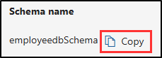

---
lab:
  title: "Exercice\_2\_: créer et gérer des types d’informations sensibles"
  module: Module 1 - Implement Information Protection
---


# Labo 1, exercice 2 : créer et gérer des types d’informations sensibles

Joni Sherman, administrateur de la sécurité des informations chez Contoso Ltd., met à jour la stratégie de protection des informations de l’organisation après les incidents précédents impliquant le partage involontaire de données personnelles dans les tickets de support. Elle doit créer et tester des types d’informations sensibles personnalisés qui permettent de détecter les ID et les références des employés aux informations de santé personnelles dans les documents et les e-mails.

**Tâches :**

1. Créer un type d'informations sensibles personnalisées
1. Modifier le niveau de confiance pour réduire les faux positifs
1. Créer un groupe de sécurité et attribuer des rôles pour créer un classifieur EDM
1. Créer un type d’informations de classification basé sur une EDM
1. Créer une source de données de classification basée sur une EDM
1. Créer un dictionnaire de mots clés
1. Tester des types d’informations sensibles personnalisés

## Tâche 1 : créer des types d’informations sensibles personnalisés

Dans cette tâche, vous allez créer un nouveau type d’informations sensibles personnalisé qui reconnaît le modèle des ID d’employés via les mots clés « Employé » et « ID ».

1. Vous devez toujours être connecté à la machine virtuelle Client 1 (SC-401-CL1) en tant que compte **SC-401-CL1\admin**.

1. Ouvrez **Microsoft Edge**, accédez à **`https://purview.microsoft.com`** et connectez-vous au portail Microsoft Purview en tant que `JoniS@WWLxZZZZZZ.onmicrosoft.com` (où ZZZZZZ est votre ID de locataire unique fourni par votre fournisseur d’hébergement de labo). Le mot de passe de Joni a été défini dans un exercice précédent.

1. Dans la barre latérale de gauche, sélectionnez **Solutions**, puis **Protection des données**.

1. Dans la barre latérale de gauche, développez **Classificateurs**, puis sélectionnez **Types d’informations sensibles**.

1. Sur la page **Types d’informations sensibles**, sélectionnez **+ Créer un type d’informations sensibles** pour démarrer la configuration du type d’informations sensibles.

1. Sur la page **Nommer votre type d’informations sensibles**, saisissez :

    - **Nom :** `Contoso Employee IDs`
    - **Description** : `Pattern for Contoso employee IDs.`

1. Cliquez sur **Suivant**.

1. Dans la page **Définir des modèles pour ce type d’informations sensibles**, sélectionnez **Créer un modèle**.

1. Dans le panneau volant **Nouveau modèle** à droite, sélectionnez **+ Ajouter un élément principal** > **Expression régulière**.

1. À droite, dans le panneau volant **+ Ajouter une expression régulière**, saisissez :

   - **ID** : `Contoso IDs`
   - **Expression régulière** : `[A-Z]{3}[0-9]{6}`
   - Sélectionnez la case d’option _Correspondance de chaîne_.

1. Sélectionnez **Terminé** au bas du panneau volant.

1. De retour sur le panneau volant **Nouveau modèle**, dans **Éléments complémentaires**, sélectionnez le menu déroulant **+ Ajouter des éléments ou un groupe d’éléments complémentaires**, puis sélectionnez **Liste de mots clés**.

1. À droite, dans le panneau volant **Ajouter une liste de mots clés**, saisissez :

   - **ID** : `Employee ID keywords`
   - **Insensible à la casse :**

      ```text
      Employee
      ID
      ```

   - Sélectionnez la case d’option _Correspondance des mots_

1. Sélectionnez **Terminé** au bas du panneau volant.

1. De retour sur le panneau volant **Nouveau modèle**, dans **Proximité des caractères**, réduisez la valeur **Détecter les éléments principaux ET complémentaires** à `100` caractères.

1. Sélectionnez le bouton **Créer** au bas du panneau volant.

1. De retour sur la page **Définir des modèles pour ce type d’informations sensibles**, sélectionnez **Suivant**.

1. Sur la page **Choisir le niveau de confiance recommandé à afficher dans les stratégies de conformité**, utilisez la valeur par défaut, puis sélectionnez **Suivant**.

1. À la page **Vérifier les paramètres et terminer**, passez en revue les paramètres, puis sélectionnez **Créer**. Une fois la création réussie, sélectionnez **Terminé**.

1. Déconnectez-vous du compte de Joni en sélectionnant l’image de profil de Joni Sherman en haut à droite. Sélectionnez **Se déconnecter**, puis fermez la fenêtre du navigateur.

Vous avez créé un nouveau type d’informations sensibles pour identifier les ID d’employés suivant le modèle de trois caractères majuscules, six nombres et les mots clés « Employé » ou « ID » dans une plage de 100 caractères.

## Tâche 2 : modifier le niveau de confiance pour réduire les faux positifs

Vous avez reçu des rapports indiquant que certains documents contenant des ID d’employé ne sont pas détectés. Pour améliorer la couverture de détection, vous réduisez le niveau de confiance du modèle dans le type d’informations sensibles (SIT) portant sur les ID d’employé Contoso afin qu’il se déclenche même lorsque seules des preuves partielles sont trouvées, ce qui augmente la probabilité de détection.

1. Vous devez toujours être connecté à la machine virtuelle Client 1 (SC-401-CL1) en tant que compte **SC-401-CL1\admin** et connecté à Microsoft Purview en tant que Joni Sherman.

1. Dans Microsoft Edge, accédez à `https://purview.microsoft.com`.

1. Dans le volet de navigation gauche, sélectionnez **Solutions** > **Protection des informations** > **Classifieurs** > **Types d’informations sensibles**

1. Recherchez `Contoso Employee IDs` dans la liste et sélectionnez le nom du SIT pour ouvrir la page de détails.

1. Sélectionnez **Modifier** en haut de la page pour modifier le SIT.

1. Sur la page **Nommer votre type d’informations sensibles**, sélectionnez **Suivant**.

1. Dans la page **Définir des modèles pour ce type d’informations sensibles**, développez **Modèle #1** et passez en revue les paramètres.

1. Sélectionnez l’icône de crayon à droite pour modifier le modèle.

1. Dans le menu volant **Modifier le modèle**, définissez la liste déroulante **Niveau de confiance** sur **Confiance moyenne**, ce qui permet des correspondances avec moins de preuves qu’avec la confiance élevée.

1. Sélectionnez **Mettre à jour** en bas du menu volant.

1. Sélectionnez **Suivant** jusqu’à atteindre la page **Vérifier les paramètres et terminer**.

1. Sélectionnez **Enregistrer**, puis **Terminé** pour mettre à jour votre type d’informations sensibles.

Vous avez réduit avec succès le niveau de confiance de façon à augmenter la sensibilité de votre SIT personnalisé, ce qui vous permet de vous assurer que les documents dont le contenu présente une correspondance partielle sont plus susceptibles d’être marqués d’un indicateur.

## Tâche 3 : créer un groupe de sécurité et attribuer des rôles pour créer un classifieur EDM

Dans cette tâche, vous allez créer le groupe de rôles de façon à créer un classifieur EDM et ajouter Joni au nouveau groupe de rôles.

1. Vous devez toujours être connecté à la machine virtuelle Client 1 (SC-401-CL1) en tant que compte **SC-401-CL1\admin**.

1. Ouvrez **Microsoft Edge** et accédez à **`https://admin.microsoft.com`**.

1. Lorsque la page **Choisir un compte** s’affiche, sélectionnez **Utiliser un autre compte** et connectez-vous en tant qu’**administrateur MOD**`admin@WWLxZZZZZZ.onmicrosoft.com` (où ZZZZZZ est votre ID de locataire unique fourni par votre fournisseur d’hébergement de labo). Le mot de passe d’administrateur doit être fourni par l’hébergeur de votre labo.

1. Dans le volet gauche, développez **Équipes et groupes**, puis sélectionnez **Équipes et groupes actifs**.

1. En haut de la page **Équipes et groupes actifs**, sélectionnez **Groupes de sécurité**, puis **+ Ajouter un groupe de sécurité**.

    

1. Dans l’écran **Configurer les éléments de base** , entrez les informations suivantes :

    - **Nom :** `EDM_DataUploaders`
    - **Description** : `People who upload data for EDM.`

1. Cliquez sur **Suivant**.

1. Dans la page **Modifier les paramètres**, conservez les paramètres par défaut et sélectionnez **Suivant**.

1. Dans la page **Vérifier et terminer l’ajout du groupe**, passez en revue vos paramètres, puis sélectionnez **Créer le groupe**.

1. Dans la page de **création du groupe EDM_DataUploaders** , sélectionnez **Fermer**.

1. Dans la page **Équipes et groupes actifs**, assurez-vous de sélectionner l’onglet **Sécurité** dans le ruban de navigation supérieur, puis cliquez sur le bouton **Actualiser** pour afficher le groupe de sécurité nouvellement créé. Sélectionnez le groupe **EDM_DataUploaders** dans la liste pour ouvrir le panneau volant **EDM_DataUploaders** à droite.

1. Sélectionnez l’onglet **Membres** , puis **Afficher tout et gérer les membres**.

1. Dans la page **Membres**, sélectionnez **+ Ajouter des membres**.

1. Dans la page **Ajouter des membres**, cochez la case à gauche de **Joni Sherman**, puis sélectionnez le bouton **Ajouter (1)** en bas du volet volant.

1. Vérifiez que **Joni Sherman** est répertorié sous **Membres**, puis fermez le panneau volant en sélectionnant le bouton **X** en haut à droite du panneau volant.

1. Déconnectez-vous ensuite du compte Administrateur Mod. Pour ce faire, sélectionnez l’icône MA en haut à droite de la fenêtre, puis **Se déconnecter** et fermez la fenêtre du navigateur.

Vous avez créé le **groupe EDM_DataUploaders** et autorisé Joni à créer un classifieur EDM.

## Tâche 4 : créer un type d’informations de classification basé sur une EDM

Dans cette tâche, vous allez créer une classification basée sur une correspondance exacte des données (EDM) à l’aide d’un schéma de base de données contenant les données des employés.

1. Ouvrez **Microsoft Edge**, puis accédez au portail Microsoft Purview à l’adresse `https://purview.microsoft.com`.

1. Lorsque la page **Choisir un compte** s’affiche, sélectionnez **Joni Sherman** et connectez-vous.

1. Accédez à la section **Protection des données** en sélectionnant **Solutions** > **Protection des données** dans la barre latérale gauche.

1. Dans la page **Protection des données**, développez **Classifieurs**, puis sélectionnez **Classifieurs EDM**.

1. Dans la page **Classifieurs EDM**, sélectionnez **+ Créer un classifieur EDM**.

1. Passez en revue la page **Familiarisez-vous avec les étapes nécessaires pour mettre votre classifieur en service** afin de comprendre le workflow de création des classifieurs EDM, puis sélectionnez **Créer un classifieur EDM**.

1. Sur la page **Nommer et décrire votre classifieur EDM**, saisissez :

    - **Nom :** `employeedb`
    - **Description** : `Employee Database schema`

1. Cliquez sur **Suivant**.

1. Dans la page **Choisir une méthode pour définir votre page de schéma**, sélectionnez **Définir manuellement votre structure de données**, puis **Suivant**.

1. Dans la page **Définir les colonnes qui contiennent les données que vous souhaitez détecter**, entrez les colonnes suivantes :

   - `Name`
   - `BirthDate`
   - `StreetAddress`
   - `EmployeeID`

   Sélectionnez **+ Ajouter une colonne** pour ajouter les champs restants jusqu’à ce que vous ayez quatre colonnes au total.

      

1. Cliquez sur **Suivant**.

1. Dans la page **Sélectionner les éléments principaux**, recherchez la colonne **EmployeeID**. Développez la liste déroulante **Mode correspondance** où **Jeton unique** s’affiche. Sélectionnez le **+** (signe plus) pour **choisir un SIT**.

      

1. Dans le panneau volant **Choisir un type d’infos sensibles pour « EmployeeID »** à droite, dans la barre de recherche, recherchez `Contoso`.

1. Le type d’infos sensibles **Contoso Employee IDs** créé dans une tâche précédente doit être affiché. Cochez la case à gauche de ce type d’infos sensibles, puis sélectionnez **Enregistrer**.

1. Revenez à la page **Sélectionner les éléments principaux**, cochez la case à droite de **EmployeeID** pour identifier ce champ en tant qu’**élément principal**.

      

1. Cliquez sur **Suivant**.

1. Dans **Configurer les paramètres des données dans les colonnes sélectionnées**, vérifiez que le bouton bascule est défini sur **Oui** pour **Utiliser les mêmes paramètres pour toutes les colonnes**.

1. Cochez la case **Ignorer les délimiteurs et la ponctuation des données dans toutes les colonnes**.

1. Sélectionnez la liste déroulante **Choisir les délimiteurs et la ponctuation à ignorer**, puis sélectionnez :

   - _Trait d’union (-)_
   - _Point (.)_
   - _Espace ( )_
   - _Ouvrir la parenthèse (()_
   - _Fermer la parenthèse ())_

1. Cliquez n’importe où en dehors de la liste déroulante, puis sélectionnez **Suivant**.

1. Dans **Configurer les règles de détection pour les éléments principaux**, conservez la configuration par défaut, puis sélectionnez **Suivant**.

1. À la page **Vérifier les paramètres et terminer**, sélectionnez **Envoyer**.

1. Dans la page **Vous avez créé un classifieur EDM**, veillez à capturer le **nom du schéma** à utiliser dans la tâche suivante.

      

1. Une fois que vous avez capturé le nom du schéma, sélectionnez **Terminé**.

1. Laissez le navigateur ouvert avec le portail Microsoft Purview.

Vous avez créé un type d’informations sensibles de classification basé sur EDM pour identifier les données des employés à partir d’une source de fichier de base de données.

## Tâche 5 : créer une source de données de classification basée sur EDM

Dans cette tâche, vous allez hacher et charger les données réelles pour le type d’informations sensibles de classification basée sur EDM via l’outil EDM Upload Agent.

1. Vous devez toujours avoir une connexion active à la machine virtuelle Client 1 (SC-401-CL1) en tant que compte **SC-401-CL1\admin** et vous devez avoir une connexion active à Microsoft 365 en tant que **Joni Sherman**.

1. Dans **Microsoft Edge**, accédez à **`https://go.microsoft.com/fwlink/?linkid=2088639`** pour télécharger l’agent de chargement EDM.

1. Une fois le téléchargement terminé, sélectionnez **Ouvrir le fichier** dans la fenêtre du navigateur Microsoft Edge pour ouvrir l’assistant **Configuration de l’agent de chargement de correspondance de données exactes Microsoft**.

1. Dans la page **Bienvenue dans l’assistant d’installation de l’agent de chargement de correspondance de données exactes Microsoft**, sélectionnez **Suivant**.

1. Sur la page **Contrat de licence utilisateur final**, sélectionnez l’option **J’accepte les termes du contrat de licence**, puis sélectionnez **Suivant**.

1. Dans la page **Dossier de destination**, ne modifiez pas le chemin de destination par défaut, puis sélectionnez **Suivant**.

1. Dans la page **Prêt à installer l’agent de chargement de correspondance de données exactes Microsoft**, sélectionnez **Installer**.

1. Dans la fenêtre **Contrôle de compte d’utilisation**, sélectionnez **Oui** pour autoriser l’application à apporter des modifications à votre appareil.

1. Une fois l’installation terminée, sélectionnez **Terminer** dans la page **Fin de l’assistant d’installation de l’agent de chargement de correspondance de données exactes Microsoft**.

1. Dans la barre de tâches, recherchez `Notepad` dans le champ de recherche. Sélectionnez l’application **Bloc-notes** dans la section **Meilleure correspondance** de la recherche.

1. Dans le Bloc-notes, entrez :

    ``` text
    Name,Birthdate,StreetAddress,EmployeeID
    Joni Sherman,01.06.1980,1 Main Street,CSO123456
    Lynne Robbins,31.01.1985,2 Secondary Street,CSO654321
    ```

1. Dans le Bloc-notes, sélectionnez **Fichier** et **Enregistrer sous** pour enregistrer le fichier.

1. Sélectionnez **Documents** dans le volet latéral gauche, puis entrez `EmployeeData.csv` comme **Nom du fichier**, puis sélectionnez **Enregistrer**.

1. Fermez la fenêtre du Bloc-notes.

1. Cliquez avec le bouton droit sur le symbole Windows dans la barre des tâches, puis sélectionnez **Terminal (Admin)**.

1. Dans la fenêtre **Contrôle de compte d’utilisation**, sélectionnez **Oui** pour autoriser l’application à apporter des modifications à votre appareil.

1. Dans la fenêtre de terminal, accédez au répertoire de l’agent de chargement EDM :

    ``` powershell
    cd "C:\Program Files\Microsoft\EdmUploadAgent"
    ```

1. Autorisez avec votre compte à charger la base de données sur votre locataire en exécutant ce cmdlet de commande :

    ``` powershell
    .\EdmUploadAgent.exe /Authorize
    ```

1. Lorsque la fenêtre **Choisir un compte** s’affiche, connectez-vous en tant que `JoniS@WWLxZZZZZZ.onmicrosoft.com` (où ZZZZZZ est votre ID de locataire unique fourni par votre fournisseur d’hébergement de labo). Le mot de passe de Joni a été défini dans un exercice précédent.

1. De retour dans la fenêtre de terminal, téléchargez la définition de schéma de base de données du type d’informations sensibles de classification basée sur EDM en exécutant ce script dans PowerShell. Pour **DataStoreName**, il s’agit de l’emplacement où vous allez utiliser le nom de schéma enregistré à partir de la tâche précédente.

    ``` powershell
    .\EdmUploadAgent.exe /SaveSchema /DataStoreName employeedbSchema /OutputDir "C:\Users\Admin\Documents\"
    ```

    Vous devez recevoir un message indiquant que l’exécution de la commande s’est terminée correctement.

    > [!Note] **Note** : si la dernière commande échoue, il faut peut-être plus de temps jusqu’à ce que l’appartenance au groupe **EDM_DataUploaders** soit appliquée. Cela peut prendre jusqu’à une heure jusqu’à ce qu’il soit possible de télécharger le fichier de schéma.  En cas d’échec, passez à la tâche suivante et revenez à cette étape ultérieurement.

1. Hachez le fichier de base de données et chargez-le dans le type d’informations sensibles de classification basé sur EDM en exécutant le script suivant dans PowerShell :

    ``` powershell
    .\EdmUploadAgent.exe /UploadData /DataStoreName employeedbSchema /DataFile "C:\Users\Admin\Documents\EmployeeData.csv" /HashLocation "C:\Users\Admin\Documents\" /Schema "C:\Users\Admin\Documents\employeedbSchema.xml"
    ```

    Vous devez recevoir un message indiquant que l’exécution de la commande s’est terminée correctement.

1. Vérifiez la progression du chargement avec cette commande :

    ``` powershell
    .\EdmUploadAgent.exe /GetSession /DataStoreName employeedbSchema
    ```

1. Dans la fenêtre de terminal, une fois dans l’état **Terminé**, vos données EDM sont prêtes à être utilisées.

    Vous pouvez également actualiser la fenêtre des **classifieurs EDM** dans le portail Microsoft Purview pour vérifier l’état du hachage. Une fois que l’état est défini sur **Index terminé**, le hachage est terminé.

    > [!Note] **Note** : ce processus peut prendre du temps. Vous devrez peut-être exécuter le script GetSession ou actualiser la page des classifieurs EDM plusieurs fois avant que l’état indique que le hachage est terminé.

    

    

1. Fermez la fenêtre de terminal.

Vous avez correctement haché et chargé un fichier de base de données pour un type d’informations sensibles de classification basé sur EDM.

## Tâche 6 : créer un dictionnaire de mots clés

Plusieurs violations des fuites d’informations personnelles se sont produites lorsque les utilisateurs ont envoyé des e-mails après que les collègues ont signalé un congé de maladie. Dans ces cas, la raison de la maladie a été divulguée. Cela ne doit pas arriver. Dans cette tâche, vous allez créer un dictionnaire de mots clés pour empêcher les fuites d’informations personnelles dans les e-mails.

1. Vous devez toujours avoir une connexion active à la machine virtuelle Client 1 (SC-401-CL1) en tant que compte **SC-401-CL1\admin** et vous devez avoir une connexion active à Microsoft 365 en tant que **Joni Sherman**.

1. Le portail Microsoft Purview doit toujours se trouver dans la page des classifieurs EDM dans Microsoft Edge. Dans le portail Microsoft Purview, accédez à `https://purview.microsoft.com` > **Solutions** > **Protection des données**.

1. Dans la barre latérale de gauche, développez **Classifieurs**, puis sélectionnez **Types d’informations sensibles**.

1. Sélectionnez **+ Créer un type d’informations sensibles** pour ouvrir la configuration d’un nouveau type d’informations sensibles.

1. Sur la page **Nommer votre type d’informations sensibles**, saisissez :

    - **Nom :** `Contoso Diseases List`
    - **Description** : `List of possible diseases of employees.`

1. Cliquez sur **Suivant**.

1. Dans la page **Définir des modèles pour ce type d’informations sensibles**, sélectionnez **+ Créer un modèle**.

1. Dans le panneau volant **Nouveau modèle** à droite, sous **Élément principal**, sélectionnez **+ Ajouter un élément principal**, puis sélectionnez **Dictionnaire de mots clés**.

1. Dans la page **Ajouter un dictionnaire de mots clés**, entrez :

   - **Nom :** `Diseases Dictionary`
   - **Mots clés :**

    ```text
    flu
    influenza
    cold
    bronchitis
    otitis
    ```

1. Sélectionnez **Terminé** au bas du panneau volant.

1. De retour dans la page **Nouveau modèle**, sous **Éléments secondaires**, sélectionnez **+ Ajouter des éléments ou un groupe d’éléments secondaires**, puis sélectionnez **Liste de mots clés** pour ajouter une prise en charge supplémentaire au dictionnaire de mots-clés.

1. Dans la page **Ajouter une liste de mots clés**, entrez :

   - **ID** : `Employee absence`
   - **Insensible à la casse :**

    ``` text
    employee
    absence
    reason
    ```

1. Sélectionnez **Terminé** au bas du panneau volant.

1. De retour sur la page **Nouveau modèle**, passez en revue la configuration et sélectionnez **Créer**.

1. De retour sur la page **Définir des modèles pour ce type d’informations sensibles**, sélectionnez **Suivant**.

1. Dans la page **Choisir le niveau de confiance recommandé à afficher dans les stratégies de conformité**, laissez la valeur par défaut sélectionnée, puis sélectionnez **Suivant**.

1. Dans la page **Vérifier les paramètres et terminer**, passez en revue vos paramètres, puis sélectionnez **Créer**. Une fois votre type d’informations sensibles créé, sélectionnez **Terminé** dans la page **Vos informations sensibles**.

1. Laissez la fenêtre du navigateur dans le portail Microsoft Purview ouverte.

Vous avez créé un type d’informations sensibles en fonction d’un dictionnaire de mots clés et ajouté d’autres mots clés pour réduire le taux de faux positifs.

## Tâche 7 : créer des types d’informations sensibles personnalisés

Testez toujours les types d’informations sensibles personnalisés avant de les utiliser dans les stratégies. Sinon, la perte ou les fuites de données peuvent se produire si le modèle est mal configuré.

1. Vous devez toujours avoir une connexion active à la machine virtuelle Client 1 (SC-401-CL1) en tant que compte **SC-401-CL1\admin** et vous devez avoir une connexion active à Microsoft 365 en tant que **Joni Sherman**.

1. Dans la barre de tâches, recherchez `Notepad` dans le champ de recherche. Sélectionnez l’application **Bloc-notes** dans la section **Meilleure correspondance** de la recherche.

1. Dans le Bloc-notes, entrez :

    ``` text
    Employee Joni Sherman EMP123456 is absent because of the flu/influenza.
    ```

1. Sélectionnez **Fichier** > **Enregistrer sous**.

1. Sélectionnez **Documents** dans le volet latéral gauche, puis entrez `SickTestData.txt` comme **Nom du fichier**, puis sélectionnez **Enregistrer**.

1. Fermez la fenêtre du Bloc-notes.

1. De retour dans **Microsoft Edge**, le portail Microsoft Purview doit toujours être ouvert sur la page **Types d’informations sensibles**.

1. Dans la barre de **Recherche** en haut à droite, entrez `Contoso` et appuyez sur Entrée.

1. Sélectionnez **Contoso Employee IDs**.

1. Sélectionnez **Test**.

1. Dans le panneau volant **Charger un fichier pour tester « Contoso Employee IDs »** sur la droite, sélectionnez **Charger le fichier**.

1. Sélectionnez **Documents** dans le volet gauche, sélectionnez le fichier _SickTestData.txt_, puis sélectionnez **Ouvrir**.

1. Sélectionnez **Tester** pour démarrer l’analyse.

1. Dans la page **Résultats de correspondance**, passez en revue les correspondances, puis sélectionnez **Terminer** pour terminer le test.

1. Revenez à **Types d’informations sensibles** et cherchez `Contoso` à nouveau.

1. Cette fois, sélectionnez le type d’informations sensibles de la **Contoso Diseases List**, puis sélectionnez **Tester**.

1. Dans le panneau volant **Charger un fichier pour tester « Contoso Diseases List »** sur la droite, sélectionnez **Charger le fichier**.

1. Dans le volet **Charger le fichier pour tester**, sélectionnez **Charger le fichier**.

1. Sélectionnez **Documents** dans le volet gauche, sélectionnez le fichier _SickTestData.txt_, puis sélectionnez **Ouvrir**.

1. Sélectionnez **Tester** pour démarrer l’analyse.

1. Dans la page **Résultats de correspondance**, passez en revue les correspondances, puis sélectionnez **Terminer** pour terminer le test.

Vous avez testé les deux types d’informations sensibles personnalisés et validé que les modèles de recherche fonctionnent comme prévu.
