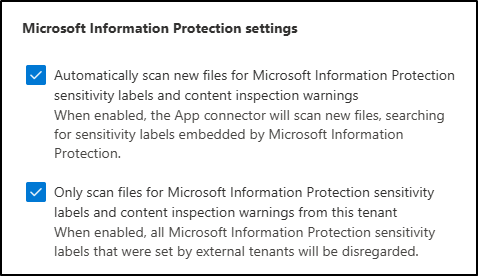
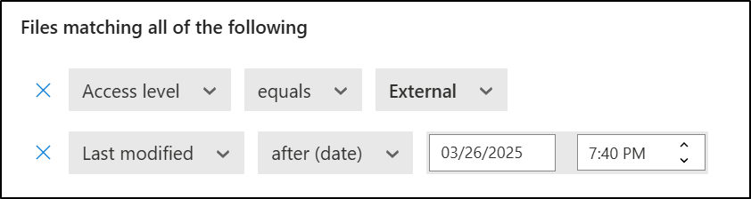

---
lab:
  title: "Exercice\_3\_: créer et gérer les étiquettes de confidentialité"
  module: Module 1 - Implement Information Protection
---

# Labo 1 - Exercice 3 : créer et gérer les étiquettes de confidentialité

Joni Sherman, administrateur de sécurité des informations chez Contoso Ltd., déploie une stratégie d’étiquetage de confidentialité pour protéger les données sensibles entre les services. Dans le cadre de cet effort, la configuration de l’étiquetage manuel et automatique, des sous-étiquettes et des options de chiffrement est effectuée, notamment la prise en charge du chiffrement à clé double (DKE) et l’intégration à Microsoft Defender for Cloud Apps.

**Tâches :**

1. Activer la prise en charge des étiquettes de confidentialité
1. Créer une étiquette de confidentialité
1. Créer une sous-étiquette
1. Publier les étiquettes de confidentialité
1. Configurer l’étiquetage automatique
1. Créer et publier une étiquette DKE pour du contenu hautement confidentiel
1. Activer l’intégration Microsoft Purview à Defender for Cloud Apps.
1. Créer une stratégie de fichier pour étiqueter automatiquement des fichiers partagés en externe

## Tâche 1 : activer la prise en charge des étiquettes de confidentialité

Dans cette tâche, vous allez activer la co-création pour les étiquettes de confidentialité, ce qui active également les étiquettes de confidentialité pour les fichiers dans SharePoint et OneDrive.

1. Vous devez toujours avoir une connexion active à la machine virtuelle Client 1 (SC-401-CL1) en tant que compte **SC-401-CL1\admin** et une connexion active à Microsoft Purview en tant que Joni Sherman.

1. Ouvrez **Microsoft Edge** et accédez à `https://purview.microsoft.com`.

1. Dans le volet de navigation gauche, sélectionnez **Paramètres** > **Protection des données**.

1. Dans les **paramètres Protection des données**, vérifiez que vous êtes sur l’onglet **Co-édition de fichiers avec des étiquettes de confidentialité**.

1. Cochez la case pour **Activer la co-édition des fichiers avec des étiquettes de confidentialité**.

1. Sélectionner **Appliquer** en bas de l’écran.

Vous avez activé la prise en charge des étiquettes de confidentialité pour les fichiers SharePoint et OneDrive.

## Tâche 2 : créer une étiquette de confidentialité

Dans cette tâche, vous allez créer une étiquette de confidentialité parent pour le contenu interne. Cette étiquette inclut des paramètres de base et agit en tant qu’étiquette parent pour les sous-étiquettes propres au service.

1. Vous devez toujours être connecté à la machine virtuelle Client 1 (SC-401-CL1) en tant que compte **SC-401-CL1\admin**.

1. Dans **Microsoft Edge**, accédez à `https://purview.microsoft.com`.

1. Dans le portail Microsoft Purview, sélectionnez **Solutions** dans la barre latérale de gauche, puis sélectionnez **Protection des données**.

1. Sur la page **Protection des données Microsoft**, dans la barre latérale de gauche, sélectionnez **Étiquettes de confidentialité**.

1. Sur la page **Étiquettes de confidentialité**, sélectionnez **+ Créer une étiquette**.

1. La configuration de la **nouvelle étiquette de confidentialité** démarre alors. Dans **Fournir des détails de base pour cette étiquette**, saisissez :

    - **Nom :** `Internal`
    - **Nom d’affichage** : `Internal`
    - **Description pour les utilisateurs** : `Internal sensitivity label.`
    - **Description pour les administrateurs** : `Internal sensitivity label for Contoso.`

1. Cliquez sur **Suivant**.

1. Dans la page **Définir l’étendue de cette étiquette**, sélectionnez **Fichiers** et **E-mails**. Si la case **Réunions** est cochée, décochez-la.

1. Cliquez sur **Suivant**.

1. Sur la page **Choisir les paramètres de protection pour les éléments étiquetés**, sélectionnez **Suivant**.

1. Sur la page **Étiquetage automatique des fichiers et des e-mails**, sélectionnez **Suivant**.

1. Sur la page **Définir les paramètres de protection pour les groupes et les sites**, sélectionnez **Suivant**.

1. Dans la page **Vérifier vos paramètres et terminer**, sélectionnez **Créer une étiquette**.

1. Dans la page **Votre étiquette de confidentialité a été créée**, sélectionnez **Ne pas créer de stratégie pour le moment**, puis **Terminé**.

Vous avez créé une étiquette de confidentialité pour une utilisation interne. Cette étiquette servira d’étiquette parent pour des sous-étiquettes plus spécifiques utilisées dans différents services.

## Tâche 3 : créer une sous-étiquette

Maintenant que vous disposez d’une étiquette de base, vous allez créer une sous-étiquette pour les documents liés aux ressources humaines. Cette sous-étiquette inclut les paramètres de protection et les marquages de contenu visibles pour prendre en charge les pratiques de gestion des données internes pour le service RH.

1. Sur la page **Étiquettes de confidentialité**, recherchez l’étiquette de confidentialité **interne** nouvellement créée. Sélectionnez les points de suspension verticaux (**...**) à côté de celle-ci, puis sélectionnez **+ Créer une sous-étiquette** dans le menu déroulant.

    

1. L’assistant **Nouvelle étiquette de confidentialité** démarre alors. Sur la page **Fournir des détails de base pour cette étiquette**, saisissez :

   - **Nom :** `Employee data (HR)`
   - **Nom d’affichage** : `Employee data (HR)`
   - **Description pour les utilisateurs** : `This HR label is the default label for all specified documents in the HR Department.`
   - **Description pour les administrateurs** : `This label is created in consultation with Ms. Jones (Head of HR department). Contact her if you need to change the label settings.`

1. Cliquez sur **Suivant**.

1. Dans la page **Définir l’étendue de cette étiquette**, sélectionnez **Fichiers** et **E-mails**. Si la case **Réunions** est cochée, décochez-la.

1. Cliquez sur **Suivant**.

1. Sur la page **Choisir les paramètres de protection des éléments étiquetés**, sélectionnez les options **Contrôle d’accès** et **Appliquer le marquage du contenu**, puis sélectionnez **Suivant**.

1. Sur la page **Contrôle d’accès**, sélectionnez **Configurer les paramètres de contrôle d’accès**.

1. Configurez les paramètres de chiffrement avec les options suivantes :

   - **Attribuer des autorisations maintenant ou laisser les utilisateurs décider ?**  : attribuer des autorisations maintenant.
   - **L’accès des utilisateurs au contenu expire** : jamais.
   - **Autoriser l’accès hors connexion** : uniquement pendant un certain nombre de jours.
   - **Les utilisateurs disposent d’un accès hors connexion au contenu pendant ce nombre de jours** : 15.
   - Sélectionnez le lien **Attribuer des autorisations**. Dans le panneau volant **Attribuer des autorisations**, sélectionnez **+ Ajouter des utilisateurs authentifiés**, puis sélectionnez **Enregistrer** pour appliquer ce paramètre.

1. Sur la page **Contrôle d’accès**, sélectionnez **Suivant**.

1. Sur la page **Marquage du contenu**, sélectionnez le bouton pour activer le **Marquage du contenu**.

1. Pour chacun des types de marquage suivants, cochez la case, puis sélectionnez l’icône d’édition pour entrer le texte :

   |Type de marquage|Détails|
   |:---|:---|
   |Ajouter un filigrane|`INTERNAL USE ONLY`|
   |Ajouter un en-tête|`Internal Document`|
   |Ajouter un pied de page|`Contoso Confidential`|

1. Cliquez sur **Suivant**.

1. Sur la page **Étiquetage automatique des fichiers et des e-mails**, sélectionnez **Suivant**.

1. Sur la page **Définir les paramètres de protection pour les groupes et les sites**, sélectionnez **Suivant**.

1. Dans la page **Vérifier vos paramètres et terminer**, sélectionnez **Créer une étiquette**.

1. Dans la page **Votre étiquette de confidentialité a été créée**, sélectionnez **Ne pas créer de stratégie pour le moment**, puis **Terminé**.

Vous avez créé une sous-étiquette qui applique les marquages de chiffrement et de contenu aux documents RH. Cette étiquette permet de s’assurer que les données RH sont uniquement accessibles aux utilisateurs authentifiés et peuvent être identifiées par des marquages visuels.

## Tâche 4 : publier des étiquettes de confidentialité

Vous allez maintenant publier l’étiquette de confidentialité interne et RH afin que les étiquettes de confidentialité publiées puissent être appliquées par les utilisateurs RH à leurs documents RH.

1. Vous devez toujours avoir une connexion active à la machine virtuelle Client 1 (SC-401-CL1) en tant que compte **SC-401-cl1\admin**, et vous devez avoir une connexion active à Microsoft Purview en tant que **Joni Sherman**.

1. Dans **Microsoft Edge**, l’onglet du portail Microsoft Purview devrait encore être ouvert. Si ce n’est pas le cas, accédez à **`https://purview.microsoft.com`** > **Solutions** > **Protection des données** > **Étiquettes de confidentialité**.

1. Sur la page **Étiquettes de confidentialité**, sélectionnez **Publier des étiquettes**.

1. La configuration de la publication des étiquettes de confidentialité démarre alors.

1. Sur la page **Choisir les étiquettes de confidentialité à publier**, sélectionnez le lien **Choisir les étiquettes de confidentialité à publier**.

1. Dans le panneau volant **Étiquettes de confidentialité à publier**, cochez les cases **Interne** et **Données internes/employés (RH)**, puis sélectionnez **Ajouter** en bas de la page volante.

1. De retour sur la page **Choisir des étiquettes de confidentialité à publier**, sélectionnez **Suivant**.

1. Sur la page **Affecter des unités d’administration**, sélectionnez **Suivant**.

1. Sur la page **Publier pour les utilisateurs et les groupes**, sélectionnez **Suivant**.

1. Sur la page **Paramètres de stratégie**, sélectionnez **Suivant**.

1. Sur la page **Paramètres par défaut des documents**, sélectionnez **Suivant**.

1. Sur la page **Paramètres par défaut des e-mails**, sélectionnez **Suivant**.

1. Sur la page **Paramètres par défaut des réunions et des événements de calendrier**, sélectionnez **Suivant**.

1. Sur la page **Paramètres par défaut du contenu Fabric et Power BI**, sélectionnez **Suivant**.

1. Sur la page **Nommer votre stratégie**, saisissez :

   - **Nom :** `Internal HR employee data`

   - **Entrez une description pour votre stratégie d’étiquette de confidentialité** : `This HR label is to be applied to internal HR employee data.`

1. Cliquez sur **Suivant**.

1. Sur la page **Vérifier et terminer**, sélectionnez **Envoyer**.

1. Dans la page **Nouvelle stratégie créée**, sélectionnez **Terminé** pour terminer la publication de votre stratégie d’étiquette.

Vous avez publié les étiquettes de confidentialité internes et RH. Notez que cela peut prendre jusqu’à 24 heures pour que les modifications soient répliquées pour tous les utilisateurs et tous les services.

## Tâche 5 : configurer l’étiquetage automatique

Dans cette tâche, vous allez créer une étiquette de confidentialité pour les données financières et la configurer pour qu’elle s’applique automatiquement au contenu contenant des identifiantsfinanciers spécifiques, tels que les numéros de carte de crédit et les informations de routage bancaire.

1. Vous devez toujours avoir une connexion active à la machine virtuelle Client 1 (SC-401-CL1) en tant que compte **SC-401-cl1\admin**.

1. Dans **Microsoft Edge**, accédez à `https://purview.microsoft.com` et connectez-vous au portail Microsoft Purview en tant que **Joni Sherman**.

1. Dans le portail Microsoft Purview, sélectionnez **Solutions** > **Protection des données** > **Étiquettes de confidentialité**.

1. Sur la page **Étiquettes de confidentialité**, recherchez l’étiquette de confidentialité **Interne**. Sélectionnez les points de suspension verticaux (**...**), puis sélectionnez **+ Créer une sous-étiquette** dans le menu déroulant.

1. Sur la page **Fournir des détails de base pour cette étiquette**, saisissez :

   |Détails|Détails|
   |---|---|
   |**Nom**|`Financial Data`|
   |**Nom complet**|`Financial Data`|
   |**Description pour les utilisateurs**|`This content contains financial data that must be labeled and protected.`|
   |**Description pour les administrateurs**|`This label is used for content that includes sensitive financial identifiers.`|

1. Cliquez sur **Suivant**.

1. Dans la page **Définir l’étendue de cette étiquette**, sélectionnez **Fichiers** et **E-mails**. Si la case **Réunions** est cochée, décochez-la.

1. Cliquez sur **Suivant**.

1. Sur la page **Choisir les paramètres de protection pour les éléments étiquetés**, sélectionnez **Suivant**.

1. Sur la page **Étiquetage automatique des fichiers et des e-mails**, activez l’option **Étiquetage automatique des fichiers et des e-mails**.

1. Dans la section **Détecter le contenu qui correspond à ces conditions**, sélectionnez **+ Ajouter une condition** > **Contenu contenant**.

1. Dans la section **Le contenu contient**, sélectionnez **Ajouter** > **Types d’informations sensibles**.

1. Dans la page volante **Types d’informations sensibles**, recherchez et sélectionnez ces types d’informations sensibles :

   - `Credit Card Number`
   - `ABA Routing Number`
   - `SWIFT Code`

1. Sélectionnez **Ajouter**.

1. De retour sur la page **Étiquetage automatique des fichiers et des e-mails**, sélectionnez **Suivant**.

1. Sur la page **Définir les paramètres de protection pour les groupes et les sites**, sélectionnez **Suivant**.

1. Dans la page **Vérifier vos paramètres et terminer**, sélectionnez **Créer une étiquette**.

1. Dans la page **Votre étiquette de confidentialité a été créée**, sélectionnez **Appliquer automatiquement l’étiquette au contenu sensible**, puis sélectionnez **Terminé**.

1. Dans la page volante **Créer une stratégie d’étiquetage automatique**, sélectionnez **Vérifier la stratégie**.

1. Dans la page **Nommer votre stratégie d’étiquetage automatique**, conservez la valeur par défaut, puis sélectionnez **Suivant**.

1. Dans la page **Choisir une étiquette à appliquer automatiquement**, vérifiez que l’étiquette _Données internes/financières_ est sélectionnée, puis sélectionnez **Suivant**.

1. Sur la page **Affecter des unités d’administration**, sélectionnez **Suivant**.

1. Dans la page **Choisir les emplacements où vous souhaitez appliquer l’étiquette**, sélectionnez les options pour :

   - Messagerie Exchange
   - Sites SharePoint
   - Comptes OneDrive

1. Cliquez sur **Suivant**.

1. Sur la page **Configurer des règles courantes ou avancées**, laissez l’option par défaut **Règles courantes** sélectionnée, puis sélectionnez **Suivant**.

1. Dans la page **Définir des règles pour le contenu de tous les emplacements**, développez les règles pour la _Règle de données financières_ pour vous assurer que les règles attendues sont définies, puis sélectionnez **Suivant**.

1. Sur la page **Paramètres supplémentaires des e-mails**, sélectionnez **Suivant**.

1. Sur la page **Décider si vous souhaitez tester la stratégie maintenant ou ultérieurement**, sélectionnez **Exécuter la stratégie en mode simulation** et cochez la case **Activer automatiquement la stratégie si elle n’est pas modifiée après 7 jours de simulation**.

1. Cliquez sur **Suivant**.

1. Sur la page **Vérifier et terminer**, sélectionnez **Créer la stratégie**.

1. Dans la page **Votre stratégie d’étiquetage automatique a été créée**, sélectionnez **Terminé**.

Vous avez créé une étiquette de confidentialité pour les données financières et configuré une stratégie d’étiquetage automatique pour détecter et étiqueter le contenu qui contient des informations financières sensibles.

## Tâche 6 : créer et publier une étiquette DKE pour du contenu confidentiel

Dans cette tâche, vous allez créer une sous-étiquette sous l’étiquette interne. Cette sous-étiquette utilise le chiffrement à clé double (DKE) et le filigrane dynamique pour protéger le contenu sensible accessible uniquement par le service juridique. Vous allez également configurer une stratégie d’étiquette qui nécessite une justification pour la rétrogradation de l’étiquette.

1. Vous devez toujours avoir une connexion active à la machine virtuelle Client 1 (SC-401-CL1) en tant que compte **SC-401-cl1\admin**.

1. Dans **Microsoft Edge**, accédez à `https://purview.microsoft.com` et connectez-vous au portail Microsoft Purview en tant que **Joni Sherman**.

1. Dans le portail Microsoft Purview, sélectionnez **Solutions** > **Protection des données** > **Étiquettes de confidentialité**.

1. Sur la page **Étiquettes de confidentialité**, recherchez l’étiquette de confidentialité **Interne**. Sélectionnez les points de suspension verticaux (**...**), puis sélectionnez **+ Créer une sous-étiquette** dans le menu déroulant.

1. Sur la page **Fournir des détails de base pour cette étiquette**, saisissez :

   |Détails|Détails|
   |---|---|
   |**Nom**|`Highly Confidential - Legal`|
   |**Nom complet**|`Highly Confidential - Legal`|
   |**Description pour les utilisateurs**|`Use this label for highly sensitive content that must be encrypted using Double Key Encryption.`|
   |**Description pour les administrateurs**|`Label configured with DKE and dynamic watermarking for highly sensitive content.`|

1. Cliquez sur **Suivant**.

1. Dans la page **Définir l’étendue de cette étiquette**, sélectionnez **Fichiers** et **E-mails**. Si la case **Réunions** est cochée, décochez-la.

1. Dans la page **Choisir les paramètres de protection pour les types d’éléments que vous avez sélectionnés**, sélectionnez **Contrôler l’accès**, puis sélectionnez **Suivant**.

1. Sur la page **Contrôle d’accès**, sélectionnez **Configurer les paramètres de contrôle d’accès**.

1. Configurez les paramètres de chiffrement avec les options suivantes :

   - **Attribuer des autorisations maintenant ou laisser les utilisateurs décider ?**  : attribuer des autorisations maintenant.

   - **L’accès d’utilisation au contenu expire** : un certain nombre de jours après l’application de l’étiquette.

   - **L’accès expire ce nombre de jours après l’application de l’étiquette** : 5

   - **Autoriser l’accès hors connexion** : jamais

   - Sélectionnez le lien **Attribuer des autorisations**. Dans le panneau volant **Attribuer des autorisations**, sélectionnez **+ Ajouter des utilisateurs ou des groupes**.

   - Dans la page volante **Ajouter des utilisateurs ou des groupes**, recherchez et sélectionnez `Legal Team` et `Joni Sherman`, puis sélectionnez **Ajouter**.

   - Dans la page **Attribuer des autorisations**, sélectionnez **Enregistrer**.

1. De retour sur la page **Contrôle d’accès**, cochez la case à cocher **Utiliser le filigrane dynamique**, puis sélectionnez **Personnaliser le texte (facultatif)**.

1. Dans la page **Ajouter du texte personnalisé au filigrane (facultatif)**, entrez `Confidential`, puis sélectionnez les liens pour **UPN** et **Horodateur**.

1. Sélectionnez **Enregistrer** au bas de la page volante.

1. Revenez à la page **Contrôle d’accès**, cochez la case **Utiliser le chiffrement à clé double** et entrez `https://testingdke1.azurewebsites.net/Test` comme URL du service Chiffrement à clé double.

1. Cliquez sur **Suivant**.

1. Sur la page **Étiquetage automatique des fichiers et des e-mails**, sélectionnez **Suivant**.

1. Sur la page **Définir les paramètres de protection pour les groupes et les sites**, sélectionnez **Suivant**.

1. Dans la page **Vérifier vos paramètres et terminer**, sélectionnez **Créer une étiquette**.

1. Sur la page **Votre étiquette de confidentialité a été créée** , sélectionnez **Publier une étiquette sur les applications des utilisateurs**, puis sélectionnez **Terminé**.

1. Dans la page volante **Publier une étiquette**, sélectionnez **Créer une stratégie d’étiquette**.

1. Dans la page **Choisir les étiquettes de confidentialité à publier**, sélectionnez **Choisir les étiquettes de confidentialité à publier** et ajoutez l’étiquette **Hautement confidentiel** et la sous-étiquette **Hautement confidentiel - Juridique**, puis sélectionnez **Ajouter**.

1. Cliquez sur **Suivant**.

1. Sur la page **Affecter des unités d’administration**, sélectionnez **Suivant**.

1. Dans la page **Publier pour les utilisateurs et les groupes**, conservez la valeur par défaut sélectionnée, puis sélectionnez **Suivant**.

1. Sur la page **Paramètres de stratégie**, cochez la case **Les utilisateurs doivent fournir une justification pour supprimer une étiquette ou réduire son niveau de classification**, puis sélectionnez **Suivant**.

1. Sur la page **Paramètres par défaut des documents**, sélectionnez **Suivant**.

1. Sur la page **Paramètres par défaut des e-mails**, sélectionnez **Suivant**.

1. Sur la page **Paramètres par défaut des réunions et des événements de calendrier**, sélectionnez **Suivant**.

1. Sur la page **Paramètres par défaut du contenu Fabric et Power BI**, sélectionnez **Suivant**.

1. Sur la page **Nommer votre stratégie**, saisissez :

   - **Nom :** `Highly Confidential - Legal`

   - **Description** : `Enables manual use of the DKE label for highly confidential content accessible by Legal.`

1. Cliquez sur **Suivant**.

1. Sur la page **Vérifier et terminer**, sélectionnez **Envoyer**.

1. Dans la page **Nouvelle stratégie créée**, sélectionnez **Terminé**.

Vous avez créé et publié une sous-étiquette à l’aide du chiffrement à clé double avec un filigrane dynamique. Cette étiquette offre une protection forte pour le contenu hautement confidentiel et applique l’accès restreint et la justification des modifications de classification.

## Tâche 7 : activer l’intégration de Microsoft Purview dans Defender for Cloud Apps

Dans cette tâche, vous allez activer l’intégration de Microsoft Purview à Microsoft Defender for Cloud Apps. Cela permet à Defender d’analyser de nouveaux fichiers pour les étiquettes de confidentialité Microsoft Purview et d’inspecter le contenu en fonction de ces étiquettes.

1. Vous devez toujours avoir une connexion active à la machine virtuelle Client 1 (SC-401-CL1) en tant que **SC-401-CL1\admin** et vous devez toujours avoir une connexion active en tant que Joni Sherman.

1. Ouvrez **Microsoft Edge**, puis accédez à **Microsoft Defender** en accédant à `https://security.microsoft.com`.

1. Dans le volet de navigation de gauche, sélectionnez **Paramètres**, puis sélectionnez **Applications cloud**.

1. Sous la section **Protection des données** dans le volet gauche, sélectionnez **Protection des données Microsoft**.

1. Dans la page **Protection des données Microsoft**, cochez les deux cases disponibles sur la page.

    

   - **Analyser automatiquement les nouveaux fichiers pour les étiquettes de confidentialité de protection des données Microsoft et les avertissements d’inspection du contenu**

      Permet à Defender for Cloud Apps d’analyser automatiquement des fichiers nouveaux ou modifiés pour les étiquettes de confidentialité et les avertissements d’inspection du contenu de Microsoft Purview.

   - **Analyser uniquement les fichiers pour les étiquettes de confidentialité de la protection des données Microsoft et les avertissements d’inspection de contenu de ce locataire**

      Limite l’analyse aux étiquettes et aux avertissements créés dans votre propre organisation. Les étiquettes appliquées par les locataires externes sont ignorées.

1. Sélectionnez **Enregistrer** pour appliquer les paramètres.

Vous avez activé Defender for Cloud Apps pour reconnaître et analyser des fichiers pour les étiquettes de confidentialité de Microsoft Purview.

## Tâche 8 : créer une stratégie de fichier pour étiqueter automatiquement des fichiers partagés en externe

Maintenant que l’analyse des étiquettes est activée, vous allez créer une stratégie de fichier qui applique une étiquette de confidentialité générale aux nouveaux fichiers partagés en dehors de votre organisation.

1. Dans **Microsoft Defender**, accédez à **Applications Cloud** > **Stratégies** > **Gestion des stratégies**.

1. Sélectionnez l’onglet **Protection des données**, puis sélectionnez **Créer une stratégie** > **Stratégie de fichier**.

    

1. Dans la page **Créer une stratégie de fichier**, configurez :

   - **Nom de la stratégie** : `Auto-label externally shared files`

   - **Gravité de la stratégie** : **faible**

   - **Catégorie** : **DLP**

   - Dans la **section Fichiers remplissant toutes les conditions suivantes** :

      - Pour le premier filtre, configurez les listes déroulantes sur : **Le niveau d’accès est égal à Externe**.

      - Pour le deuxième filtre, configurez les listes déroulantes sur : **Dernière modification après (date)** et utilisez la date du jour.

          

   - Sous **Actions de gouvernance**, développez **Microsoft OneDrive Entreprise** :

      - Cochez la case pour **Appliquer l’étiquette de confidentialité**.

      - Dans la liste déroulante, sélectionnez **Général-Tout le monde (sans restriction)**.

   - Répétez le même processus pour **Microsoft SharePoint Online**.

      - Cochez la case pour **Appliquer l’étiquette de confidentialité**.

      - Sélectionnez **Hautement confidentiel-Project Falcon** dans la liste déroulante.

1. Sélectionnez **Créer** pour terminer la création de la stratégie de fichier.

Vous avez créé une stratégie de fichier qui applique une étiquette de confidentialité générale aux fichiers partagés en externe dans SharePoint et OneDrive. Une fois qu’un fichier correspondant est détecté, Defender for Cloud Apps applique automatiquement l’étiquette.
