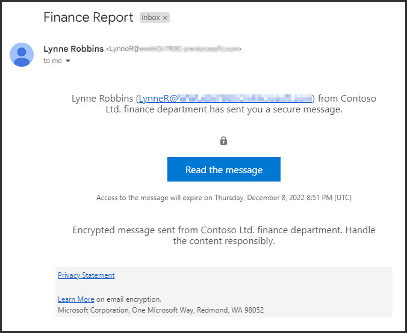

---
lab:
  title: "Exercice\_4\_: déployer le chiffrement de messages Microsoft Purview"
  module: Module 1 - Implement Information Protection
---

# Labo 1 - Exercice 4 : déployer le chiffrement de messages Microsoft Purview

Joni Sherman, administrateur de la sécurité des informations pour Contoso Ltd., a été chargé de garantir une communication sécurisée entre les services. Pour ce faire, la configuration du chiffrement de messages Microsoft Purview est effectuée pour Contoso, notamment la modification des paramètres par défaut et la création d’une expérience de personnalisation sur mesure pour le service financier.

**Tâches :**

1. Vérifier la fonctionnalité Azure RMS
1. Modifier le modèle de personnalisation par défaut
1. Valider le comportement de personnalisation par défaut
1. Créer un modèle de personnalisation sur mesure
1. Valider le comportement de personnalisation sur mesure

## Tâche 1 : vérifier la fonctionnalité Azure RMS

Dans cette tâche, vous allez vérifier la fonctionnalité Azure RMS correcte de votre locataire.

1. Vous devez toujours être connecté à la machine virtuelle Client 1 (SC-401-CL1) en tant que compte **SC-401-CL1\admin**.

1. Ouvrez PowerShell en cliquant avec le bouton droit sur le bouton Démarrer dans la barre des tâches et en sélectionnant **Terminal**.

1. Exécutez le cmdlet **Connect-ExchangeOnline** pour utiliser le module Exchange Online PowerShell et vous connecter à votre locataire :

    ```powershell
    Connect-ExchangeOnline
    ```

1. Lorsque la fenêtre **Connexion** s’affiche, connectez-vous en tant que `JoniS@WWLxZZZZZZ.onmicrosoft.com` (où ZZZZZZ est votre ID de locataire unique fourni par votre fournisseur d’hébergement de labo). Vous utiliserez le mot de passe obtenu lors de la réinitialisation du mot de passe deJoni dans un labo précédent.

1. Exécutez le cmdlet **Get-IRMConfiguration** pour vérifier qu’Azure RMS et IRM sont activés dans votre locataire :

    ```powershell
    Get-IRMConfiguration | fl AzureRMSLicensingEnabled
    ```

   Le résultat **AzureRMSLicensingEnabled** doit être **True**.

1. Exécutez le cmdlet **Test-IRMConfiguration** pour tester la fonctionnalité Azure RMS à l’aide du chiffrement de message d’Office 365 avec **Megan Bowen** comme expéditrice et destinataire :

    ```powershell
    Test-IRMConfiguration -Sender MeganB@contoso.com -Recipient MeganB@contoso.com
    ```

    

    Vérifiez que tous les tests aient un statut PASS et qu’aucune erreur n’est affichée.

1. Laissez la fenêtre PowerShell ouverte.

Vous avez correctement installé le module Exchange Online PowerShell, connecté à votre locataire et vérifié la fonctionnalité correcte d’Azure RMS.

## Tâche 2 : modifier le modèle de personnalisation par défaut

Il est nécessaire dans votre organisation de restreindre l’approbation des fournisseurs d’identité étrangers, tels que Google ou Facebook. Étant donné que ces ID sociaux sont activés par défaut pour accéder aux messages protégés par le chiffrement des messages, vous devez désactiver l’utilisation des ID sociaux pour tous les utilisateurs de votre organisation.

1. Vous devez toujours avoir une connexion active à votre machine virtuelle Client 1 (SC-401-CL1) en tant que compte **SC-401-CL1\admin** et il doit toujours y avoir une fenêtre PowerShell ouverte avec Exchange Online connecté.

1. Exécutez le cmdlet **Get-OMEConfiguration** pour afficher la configuration par défaut :

    ```powershell
    Get-OMEConfiguration -Identity "OME Configuration" | fl
    ```

   Passez en revue les paramètres et vérifiez que la propriété SocialIdSignIn a la valeur **True**.

    

1. Exécutez le cmdlet **Set-OMEConfiguration** pour restreindre l’utilisation des ID sociaux pour accéder aux messages de votre locataire protégé par OME :

    ```powershell
    Set-OMEConfiguration -Identity "OME Configuration" -SocialIdSignIn:$false
    ```

1. Confirmez le message d’avertissement pour personnaliser le modèle par défaut en entrant **Y** pour Oui, puis appuyez sur **Entrée**.

1. Exécutez le cmdlet **Get-OMEConfiguration** pour vérifier à nouveau la configuration par défaut et valider :

    ```powershell
    Get-OMEConfiguration -Identity "OME Configuration" | fl
    ```

    

   Notez que le résultat doit indiquer que SocialIdSignIn a la valeur **False**. Laissez la fenêtre PowerShell et le client ouverts.

Vous avez correctement désactivé les fournisseurs d’identité sociaux, ce qui vous permet de vous assurer que les e-mails chiffrés de Contoso ne peuvent être ouverts qu’à l’aide de comptes Microsoft ou de codes secrets à usage unique, ce qui améliore le contrôle de l’accès aux messages sensibles.

## Tâche 3 : valider le comportement de personnalisation par défaut

Vous devez confirmer qu’aucune boîte de dialogue d’ID social n’est affichée pour les destinataires externes lors de la réception d’un message protégé par le chiffrement de messages Office 365 auprès des utilisateurs de votre locataire et qu’ils doivent utiliser le protocole OTP à tout moment pour accéder au contenu chiffré.

1. Vous devez toujours avoir une connexion active à votre machine virtuelle Client 1 (SC-401-CL1) en tant que **SC-401-CL1\admin**.

1. Ouvrez **Microsoft Edge** dans une fenêtre InPrivate en cliquant avec le bouton droit sur Microsoft Edge dans la barre des tâches et en sélectionnant **Nouvelle fenêtre InPrivate**.

1. Accédez à **`https://outlook.office.com`** et connectez-vous à Outlook sur le web en tant que `LynneR@WWLxZZZZZZ.onmicrosoft.com` (où ZZZZZZ est votre ID de locataire unique fourni par votre fournisseur d’hébergement de labo). Le mot de passe de Lynne a été défini dans un exercice précédent.

1. Dans la boîte de dialogue **Rester connecté ?**, cochez la case **Ne plus afficher**, puis sélectionnez **Non**.

1. Dans Outlook sur le web, sélectionnez **Nouveau courrier**.

1. Dans la ligne **À**, entrez votre adresse e-mail personnelle ou tierce qui n’est pas dans le domaine du locataire. Saisissez **`Secret Message`** dans l’objet et **`My super-secret message.`** dans le corps de l’e-mail.

1. Dans le volet supérieur, sélectionnez **Options**, puis **Chiffrer** pour chiffrer le message. Une fois que vous avez correctement chiffré le message, vous devriez voir un avis indiquant « Chiffrer : ce message est chiffré. Les destinataires ne peuvent pas supprimer le chiffrement ».

      

1. Sélectionnez **Envoyer** pour envoyer un message. Laissez la fenêtre Outlook ouverte.

1. Connectez-vous à votre compte de messagerie personnel dans une nouvelle fenêtre et ouvrez le message de Lynne Robbins. Si vous avez envoyé cet e-mail à un compte Microsoft (comme @outlook.com) le chiffrement peut être traité automatiquement, et le message s’affiche automatiquement. Si vous avez envoyé l’e-mail à un autre service de messagerie (comme @gmail.com), vous devrez peut-être effectuer les étapes suivantes pour traiter le chiffrement et lire le message.

    > [!Note] **Note** : vous devrez peut-être vérifier votre dossier de courrier indésirable ou de spam pour trouver le message de Lynne Robbins.

1. Sélectionnez **Lire le message**.

1. Étant donné que les ID sociaux sont désactivés, vous ne devriez pas voir une option permettant de vous connecter avec un compte tiers.

1. Sélectionnez **Se connecter avec un code secret à usage unique** pour recevoir un code secret à durée limitée.

1. Accédez à votre portail de messagerie personnel et ouvrez le message avec l’objet **Votre code secret à usage unique pour afficher le message**.

1. Copiez le code secret, collez-le dans le portail OME, puis sélectionnez **Continuer**.

1. Passez en revue le message chiffré.

Vous avez testé avec succès le modèle OME par défaut modifié avec des ID sociaux désactivés.

## Tâche 4 : créer un modèle de personnalisation sur mesure

Les messages protégés envoyés par le service financier de votre organisation nécessitent une personnalisation spéciale, y compris des textes personnalisés d’introduction et de corps et un lien d’exclusion de responsabilité dans le pied de page. Les messages financiers expirent également après sept jours. Dans cette tâche, vous allez créer une configuration OME personnalisée et créer une règle de transport pour appliquer la configuration OME à tous les messages envoyés par le service financier.

1. Vous devez toujours avoir une connexion active à votre machine virtuelle Client 1 (SC-401-CL1) en tant que **SC-401-CL1\admin** et il doit toujours y avoir une fenêtre PowerShell ouverte avec Exchange Online connecté.

1. Exécutez le cmdlet **New-OMEConfiguration** pour créer une configuration :

    ```powershell
    New-OMEConfiguration -Identity "Finance Department" -ExternalMailExpiryInDays 7
    ```

1. Confirmez le message d’avertissement pour personnaliser le modèle avec **Y** pour Oui, puis appuyez sur **Entrée**.

1. Exécutez le cmdlet **Set-OMEConfiguration** avec le paramètre _IntroductionText_ pour modifier le texte d’introduction :

    ```powershell
    Set-OMEConfiguration -Identity "Finance Department" -IntroductionText " from Contoso Ltd. finance department has sent you a secure message."
    ```

1. Confirmez le message d’avertissement pour personnaliser le modèle avec **Y** pour Oui, puis appuyez sur **Entrée**.

1. Exécutez le cmdlet **Set-OMEConfiguration** avec le paramètre _EmailText_ pour mettre à jour le texte du corps de l’e-mail chiffré :

    ```powershell
    Set-OMEConfiguration -Identity "Finance Department" -EmailText "Encrypted message sent from Contoso Ltd. finance department. Handle the content responsibly."
    ```

1. Confirmez le message d’avertissement pour personnaliser le modèle avec **Y** pour Oui, puis appuyez sur **Entrée**.

1. Exécutez le cmdlet **Set-OMEConfiguration** avec le paramètre _PrivacyStatementURL_ pour modifier l’URL d’exclusion de responsabilité pour pointer vers le site de déclaration de confidentialité de Contoso :

    ```powershell
    Set-OMEConfiguration -Identity "Finance Department" -PrivacyStatementURL "https://contoso.com/privacystatement.html"
    ```

1. Confirmez le message d’avertissement pour personnaliser le modèle avec **Y** pour Oui, puis appuyez sur **Entrée**.

1. Exécutez le cmdlet **New-TransportRule** pour créer une règle de flux de courrier qui applique le modèle OME personnalisé à tous les messages envoyés par l’équipe financière. Ce processus peut prendre quelques secondes.

    ```powershell
    New-TransportRule -Name "Encrypt all mails from Finance team" -FromScope InOrganization -FromMemberOf "Finance Team" -ApplyRightsProtectionCustomizationTemplate "Finance Department" -ApplyRightsProtectionTemplate Encrypt
    ```

1. Exécutez le cmdlet **Get-OMEConfiguration** pour vérifier les modifications.

    ```powershell
    Get-OMEConfiguration -Identity "Finance Department" | Format-List
    ```

1. Fermez la fenêtre PowerShell après avoir examiné les résultats

Vous avez configuré une règle de transport qui garantit que les e-mails du service financier sont chiffrés et marqués de manière cohérente, renforçant ainsi les normes de messagerie et de sécurité de Contoso.

## Tâche 5 : valider le comportement de personnalisation sur mesure

Pour valider la nouvelle configuration personnalisée, vous devez utiliser à nouveau le compte de Lynne Robbins, membre de l’équipe financière.

1. Revenez à **Microsoft Edge** avec la fenêtre InPrivate Outlook sur le web où vous devriez toujours avoir une connexion en tant que **Lynne Robbins**.

1. Dans Outlook sur le web, sélectionnez **Nouveau courrier** dans le coin supérieur gauche de l’écran.

1. Dans la ligne **À**, entrez votre adresse e-mail personnelle ou tierce qui n’est pas dans le domaine du locataire. Entrez **`Finance Report`** dans la ligne d’objet et entrez **`Secret finance information.`** dans le corps de l’e-mail.

1. Sélectionnez **Envoyer** pour envoyer le message, puis fermez la fenêtre InPrivate dans laquelle vous avez une connexion en tant que Lynne.

1. Connectez-vous à votre compte de messagerie personnel et ouvrez le message de Lynne Robbins.

1. Vous devriez voir un message de Lynne Robbins qui ressemble à l’image ci-dessous.  Sélectionnez **Lire le message**.

    

1. Dans la configuration personnalisée, les deux options d’authentification sont disponibles, ce qui indique que la connexion à l’ID social est activée. Sélectionnez **Se connecter avec un code secret à usage unique** pour recevoir un code secret à durée limitée.

1. Accédez à votre portail de messagerie personnel et ouvrez le message avec l’objet **Votre code secret à usage unique pour afficher le message**.

1. Copiez le code secret, collez-le dans le portail et sélectionnez **Continuer**.

1. Passez en revue le message chiffré avec une personnalisation sur mesure. Fermez la fenêtre avec votre compte de courrier ouvert.

Vous avez testé avec succès le nouveau modèle personnalisé.
