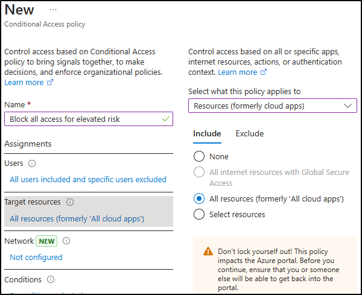

---
lab:
  title: "Exercice\_2\_: implémenter la protection adaptative"
  module: Module 3 - Implement Insider Risk Management
---

# Labo 3 - Exercice 2 : implémenter la protection adaptative

Vous êtes Joni Sherman, administrateur de la sécurité des informations pour Contoso Ltd. Votre rôle implique la protection des données sensibles et la réponse aux risques internes. Pour améliorer la protection, vous allez activer la protection adaptative Microsoft Purview, qui ajuste dynamiquement l’application de la protection contre la perte de données (DLP) en fonction des niveaux de risque internes.

**Tâches :**

1. Affecter une stratégie de risque interne à la protection adaptative
1. Configurer les paramètres de protection adaptative pour votre stratégie DLP
1. (Facultatif) Configurer l’accès conditionnel avec la protection adaptative
1. Activer la protection adaptative

## Tâche 1 : affecter une stratégie de risque interne à la protection adaptative

1. Connectez-vous à la machine virtuelle Client 1 (SC-401-CL1) en tant que compte **SC-401-cl1\admin**.

1. Dans **Microsoft Edge**, accédez à **`https://purview.microsoft.com`** et connectez-vous en tant que **Joni Sherman**`JoniS@WWLxZZZZZZ.onmicrosoft.com` (où ZZZZZZZ est votre ID de locataire unique fourni par votre fournisseur d’hébergement de labo).

1. Dans le portail Microsoft Purview, accédez à **Solutions** > **Gestion des risques internes** > **Protection adaptative**.

1. Dans le volet de navigation de gauche, sélectionnez **Niveaux de risques internes**.

1. Dans la page **Niveaux de risques internes** :

   - Dans la liste déroulante des stratégies de risques internes, sélectionnez la **Stratégie rapide de fuites de données** que vous avez créée dans un exercice précédent.
   - Laissez tous les paramètres par défaut de niveaux de risques inchangés.
   - Cliquez sur **Enregistrer**.

Vous avez lié une stratégie de risque interne à la protection adaptative, ce qui permet d’effectuer des actions dynamiques basées sur les risques dans Microsoft Purview.

## Tâche 2 : configurer les paramètres de protection adaptative pour votre stratégie DLP

Maintenant que la protection adaptative est liée à votre stratégie de risque interne, vous allez mettre à jour une stratégie DLP pour répondre aux niveaux de risque élevés en bloquant le partage de données sensibles.

1. Dans Microsoft Purview, accédez à **Solutions** > **Protection contre la perte de données** > **Stratégies**.

1. Dans la page **Stratégies**, cochez la case pour la stratégie **DLP - Protection de carte de crédit** créée dans un exercice précédent, puis sélectionnez **Modifier la stratégie**.

1. Dans la configuration DLP, sélectionnez **Suivant** jusqu’à ce que vous accédiez à la page **Personnaliser les règles DLP avancées**.

1. Sélectionnez l’icône de crayon en regard de la **Règle d’informations de carte de crédit** pour la modifier.

1. Dans la page **Modifier la règle** :
   - Dans le champ **Description**, entrez : `Block sharing of credit card data when user has an elevated insider risk level.`.
   - Dans la section **Conditions**, sélectionnez **Ajouter un e condition** > **Le niveau de risque interne pour la protection adaptative est**.
   - Dans la nouvelle section, sélectionnez **Risque élevé**.
   - Sous **Actions**, définissez **Restreindre l’accès ou chiffrer le contenu dans Microsoft 365** sur **Bloquer tout le monde**.
   - Sélectionnez **Enregistrer** pour mettre à jour la règle.

1. De retour dans la page **Personnaliser les règles DLP avancées**, sélectionnez **Suivant**.

1. Dans la page **Mode Stratégie**, conservez la stratégie active, puis sélectionnez **Suivant**.

1. Sur la page **Vérifier et terminer**, sélectionnez **Envoyer**, puis **Terminé** une fois que votre stratégie est mise à jour.

Vous avez mis à jour votre stratégie DLP pour bloquer le partage lorsque le risque interne est élevé, ce qui renforce la protection des données en fonction du comportement de l’utilisateur ou de l’utilisatrice.

## Tâche 3 (facultative) : configurer l’accès conditionnel avec la protection adaptative

Pour ajouter une autre couche d’application, vous pouvez utiliser des niveaux de risque internes pour restreindre l’accès à l’aide de l’accès conditionnel. Dans cette tâche, vous allez créer une stratégie qui bloque l’accès aux utilisateurs avec un niveau de risque interne élevé.

1. Dans Microsoft Purview, déconnectez-vous du compte de Joni et fermez toutes les fenêtres de navigateur.

1. Ouvrez une nouvelle fenêtre Microsoft Edge et accédez au **Centre d’administration Microsoft Entra** à l’adresse `https://entra.microsoft.com`. Connectez-vous en tant qu’**administrateur ou administratrice MOD**, `admin@WWLxZZZZZZ.onmicrosoft.com` (où ZZZZZZ est votre ID de locataire unique fourni par votre fournisseur d’hébergement de labo). Le mot de passe d’administration doit vous être fourni par votre fournisseur d’hébergement de labo.

1. Sélectionnez **Suivant** dans la page **Plus d’informations requises**.

1. Dans la page **Protéger votre compte**, suivez les invites pour configurer l’authentification multifacteur (MFA) à l’aide de Microsoft Authenticator ou d’une autre application d’authentification.

   Une fois l’installation de l’authentification multifacteur terminée, vous faites l’objet d’une redirection vers le **Centre d’administration Microsoft Entra**.

1. Dans le centre d’administration Microsoft Entra, accédez à **Protection** > **Accès conditionnel** > **Stratégies**.

1. Dans la page **Stratégies**, sélectionnez **+ Nouvelle stratégie**.

1. Dans la page **Nouvelle stratégie**, nommez votre stratégie : `Block all access for elevated risk`.

1. Sous **Affectations**, configurez la section **Utilisateurs** :

   - **inclure** : tous les utilisateurs  
   - **Exclure** : `Joni Sherman` et `MOD Administrator`

     

1. Sous **Ressources cibles**, confirmez que la liste déroulante est définie sur **Ressources (anciennement Applications cloud)** et sélectionnez **Toutes les ressources (anciennement « Toutes les applications cloud »)**.

     

1. Sous **Conditions**, sélectionnez **Risque interne**. Définissez **Configurer** sur **Oui**, puis définissez le niveau de risque sur **Élevé**.

     

1. Sous **Contrôles d’accès**, sélectionnez **Accorder**. Choisissez **Bloquer l’accès**, puis sélectionnez **Sélectionner** en bas du menu volant.

     

1. Au bas de la page, confirmez que le paramètre **Activer la stratégie** est défini sur **Rapport seul** et sélectionnez **Créer**.

1. De retour dans la page **Stratégies** de l’accès conditionnel, sélectionnez **Actualiser** pour vérifier que votre stratégie nouvellement créée s’affiche.

1. Déconnectez-vous du compte Administrateur Mod en sélectionnant l’icône MA en haut à droite de la fenêtre, puis en sélectionnant **Se déconnecter** et fermez toutes les fenêtres du navigateur.

Vous avez créé une stratégie d’accès conditionnel qui bloque l’accès aux utilisateurs présentant un risque élevé, sans affecter immédiatement l’accès, car la stratégie est en mode rapport seul.

## Tâche 4 : activer la protection adaptative

Dans cette dernière tâche, vous allez activer la protection adaptative afin que le système puisse commencer à appliquer une mise en œuvre dynamique basée sur les risques internes.

1. Ouvrez **Microsoft Edge**, accédez à **`https://purview.microsoft.com`** et connectez-vous en tant que **Joni Sherman**`JoniS@WWLxZZZZZZ.onmicrosoft.com` (où ZZZZZZ est votre ID de locataire unique fourni par votre fournisseur d’hébergement de labo).

1. Accédez à **Solutions** > **Gestion des risques internes** > **Protection adaptative**.

1. Confirmez vos configurations :

   - Sous l’onglet **Niveaux de risque interne**, la **stratégie rapide de fuites de données** est sélectionnée.

   - Sous l’onglet **Accès conditionnel**, la stratégie **Bloquer tout accès pour une stratégie à risque élevé** est visible (facultatif).

   - Sous l’onglet **Protection contre la perte de données**, la **stratégie DLP de protection des cartes de crédit** est répertoriée.

1. Sélectionnez l’onglet **Paramètres de protection adaptative**.

1. **Activez** la **Protection adaptative**, puis sélectionnez **Enregistrer**.

Vous avez activé la protection adaptative. Les actions de mise en œuvre s’ajustent automatiquement en fonction du niveau de risque interne d’un utilisateur.
