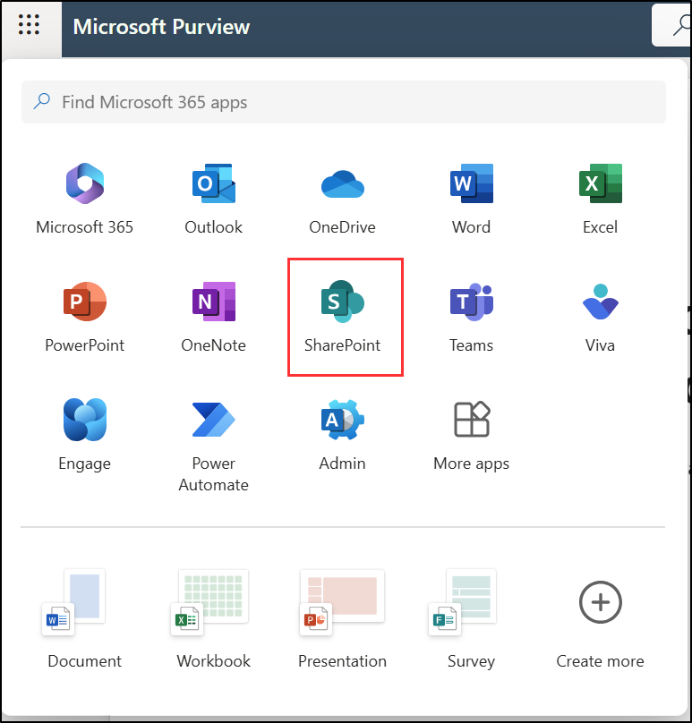

---
lab:
  title: "Exercice\_1\_: configurer les stratégies de rétention"
  module: Module 5 - Implement and manage retention
---

## Locataires WWL - Conditions d’utilisation

Si un locataire vous est fourni dans le cadre d’une formation dispensée par un instructeur, notez qu’il est mis à votre disposition dans le seul but de prendre en charge les labos pratiques de la formation.

Vous ne devez ni partager ni utiliser les locataires en dehors des labos pratiques. Le locataire utilisé dans ce cours est un locataire d’essai. Au terme de la classe, le locataire ne pourra pas faire l’objet d’une prolongation et vous ne pourrez plus l’utiliser ni y accéder.

Vous n’êtes pas autorisé à convertir un locataire en abonnement payant. Les locataires obtenus dans le cadre de ce cours sont la propriété de Microsoft Corporation. Nous nous réservons le droit d’y accéder et d’en reprendre possession à tout moment.

# Labo 5 - Exercice 1 : implémenter et gérer la rétention

Vous êtes Joni Sherman, administrateur de conformité chez Contoso Ltd. L’entreprise renforce sa stratégie de sécurité des données pour réduire l’exposition aux risques liés aux données financières et aux communications privilégiées. Vous avez reçu une invitation à configurer des solutions de rétention Microsoft Purview qui soutiennent la préparation de l’audit, limitent la rétention inutile des données et garantissent une supervision appropriée des communications sensibles.

**Tâches :**

1. Créer une étiquette de rétention
1. Publier une étiquette de rétention
1. Créer une stratégie d’étiquette de rétention à application automatique
1. Créer une stratégie de rétention statique
1. Récupérer du contenu SharePoint

## Tâche 1 : créer une étiquette de rétention

Dans cette tâche, vous allez créer une étiquette de rétention pour les données financières sensibles qui doivent être conservées à des fins d’audit et d’investigation.

1. Connectez-vous à la machine virtuelle Client 1 (SC-401-CL1) en tant que compte **SC-401-cl1\admin**.

1. Dans Microsoft Edge, accédez à `https://purview.microsoft.com` et connectez-vous au portail Microsoft Purview en tant que **Joni Sherman**`JoniS@WWLxZZZZZZ.onmicrosoft.com` (où ZZZZZZ est votre ID de locataire unique fourni par votre fournisseur d’hébergement de labo). Le mot de passe de Joni a été défini dans un exercice précédent.

1. Accédez à **Solution** > **Gestion du cycle de vie des données** > **Étiquettes de rétention**.

1. Sur la page **Étiquettes**, sélectionnez **Créer une étiquette**.

1. Sur la page **Nommer votre étiquette de rétention**, saisissez :

   - **Nom :** `Sensitive Financial Records`
   - **Description pour les utilisateurs** : `Use for financial files with sensitive data that must be retained for audit or security purposes.`
   - **Description pour les administrateurs** : `Retains high-impact financial data for 5 years to support audits and security investigations.`

1. Cliquez sur **Suivant**.

1. Sur la page **Définir les paramètres d’étiquette**, sélectionnez **Conserver les éléments indéfiniment ou pendant une période spécifique**, puis sélectionnez **Suivant**.

1. Dans la page **Définir la période**, vérifiez que ces valeurs sont définies pour l’entrée de configuration de la période de rétention :

    - **Quelle est la durée de la période ?**  : 5 ans
    - **Quand la période doit-elle commencer ?**  : quand des éléments ont été modifiés.

1. Cliquez sur **Suivant**.

1. Sur la page **Choisir ce qui se passe à la fin de la période de rétention**, sélectionnez **Supprimer automatiquement les éléments**, puis **Suivant**.

1. Sur la page **Vérifier et terminer**, sélectionnez **Créer une étiquette**.

1. Sur la page **Votre étiquette de rétention est créée**, sélectionnez l’option **Ne rien faire**, puis **Terminé**.

Vous avez créé une étiquette de rétention qui conserve le contenu financier pendant cinq ans et la supprime ensuite pour réduire l’exposition des données.

## Tâche 2 : publier une étiquette de rétention

Dans cette tâche, vous allez publier l’étiquette de rétention afin que les utilisateurs puissent l’appliquer dans les services Microsoft 365 tels qu’Exchange, SharePoint et OneDrive.

1. Dans Microsoft Purview, accédez à **Solutions** > **Gestion du cycle de vie des données** > **Étiquettes de rétention**.

1. Cochez la case en regard de l’étiquette **Enregistrements financiers sensibles**, puis sélectionnez l’icône **Publier des étiquettes** () pour publier cette étiquette de rétention.

1. Dans la page **Choisir les étiquettes à publier**, vérifiez que l’étiquette **Enregistrements financiers sensibles** est sélectionnée, puis sélectionnez **Suivant**.

1. Sur la page **Étendue de la stratégie**, sélectionnez **Suivant**.

1. Sur la page **Choisir le type de stratégie de rétention à créer**, sélectionnez **Statique**, puis **Suivant**.

1. Sur la page **Choisir où publier des étiquettes**, sélectionnez **Me laisser choisir des emplacements spécifiques** et sélectionnez :

    - Les boîtes aux lettres Exchange
    - Sites classiques et de communication SharePoint
    - Comptes OneDrive
    - Désélectionner tous les autres emplacements

1. Cliquez sur **Suivant**.

1. Sur la page **Nommer votre stratégie**, saisissez :

    - **Nom :** `Sensitive Financial Data Retention`
    - **Description** : `Makes the 'Sensitive Financial Records' label available to users in Exchange, SharePoint, and OneDrive.`

1. Cliquez sur **Suivant**.

1. Sur la page **Terminer**, sélectionnez **Envoyer**.  

1. Sur la page **Votre étiquette de rétention a été publiée**, sélectionnez **Terminé**.

Vous avez publié l’étiquette de rétention, ce qui permet aux utilisateurs de s’inscrire aux services Microsoft 365 clés.

## Tâche 3 : créer une stratégie d’étiquette de rétention à application automatique

Dans cette tâche, vous allez configurer une stratégie qui applique automatiquement une étiquette de rétention au contenu contenant des informations financières personnelles.

1. Dans Microsoft Purview, accédez à **Solutions** > **Gestion du cycle de vie des données** > **Stratégies** > **Stratégies des étiquettes**.

1. Dans la page **Stratégies des étiquettes**, sélectionnez **Appliquer automatiquement une étiquette** pour démarrer la configuration de l’étiquette.

1. Dans la page **Prise en main**, entrez :

   - **Nom :** `Auto-apply Personal Financial PII`
   - **Description** : `Applies this label to personal financial data to help meet audit and investigation requirements. Retains content for 3 years.`

1. Cliquez sur **Suivant**.

1. Sur la page **Choisir le type de contenu auquel vous voulez appliquer cette étiquette**, sélectionnez **Appliquer l’étiquette au contenu qui contient des informations sensibles**, puis **Suivant**.

1. Dans la page **Contenu qui contient des informations sensibles**, sélectionnez la catégorie **Finances**, puis sélectionnez la réglementation **U.S. Gramm-Leach-Bliley Act (GLBA)**, puis sélectionnez **Suivant**.

1. Sur la page **Définir le contenu contenant des informations confidentielles**, sélectionnez **Suivant**.

1. Sur la page **Étendue de la stratégie**, sélectionnez **Suivant**.

1. Sur la page **Choisir le type de stratégie de rétention à créer**, sélectionnez **Statique**.

1. Sur la page **Choisir où publier des étiquettes**, sélectionnez **Me laisser choisir des emplacements spécifiques** et sélectionnez :

    - Les boîtes aux lettres Exchange
    - Sites classiques et de communication SharePoint
    - Comptes OneDrive
    - Désélectionner tous les autres emplacements

1. Sur la page **Choisir une étiquette à appliquer automatiquement**, sélectionnez **Ajouter une étiquette**.

1. Dans le menu volant **Choisir une étiquette**, sélectionnez **Informations financières personnelles**, puis sélectionnez **Ajouter**.

1. De retour sur la page **Choisir une étiquette à appliquer automatiquement**, sélectionnez **Suivant**.

1. Sous **Décider de tester ou d’exécuter votre stratégie**, sélectionnez **Tester la stratégie avant de l’activer**, puis **Suivant**.

1. Sur la page **Vérifier et terminer**, sélectionnez **Envoyer**, puis **Terminé** sur la page **Votre stratégie d’étiquetage automatique a été créée**.

Vous avez créé une stratégie d’application automatique qui identifie les données financières personnelles et applique automatiquement une étiquette de rétention.

## Tâche 4 : créer une stratégie de rétention statique

Dans cette tâche, vous allez créer une stratégie de rétention statique pour le contenu Microsoft Teams afin de réduire les risques de données à long terme.

1. Dans Microsoft Purview, accédez à **Solutions** > **Gestion du cycle de vie des données** > **Stratégies** > **Stratégies de rétention**.

1. Sur la page **Stratégies de rétention**, sélectionnez **Nouvelle stratégie de rétention**.

1. Sur la page **Nommer votre stratégie de rétention**, saisissez :

   - **Nom :** `Teams Retention`
   - **Description** : `Retains Teams chats and channel messages for 3 years, then deletes them to reduce long-term data risk.`

1. Cliquez sur **Suivant**.

1. Sur la page **Étendue de la stratégie**, sélectionnez **Suivant**.

1. Sur la page **Choisir le type de stratégie de rétention à créer**, sélectionnez **Statique**, puis **Suivant**.

1. Sur la page **Choisir les emplacements pour appliquer la stratégie**, activez :

   - Messages des canaux Teams
   - Conversations Teams
   - Désactivez tous les autres emplacements.

1. Cliquez sur **Suivant**.

1. Dans la page **Décider si vous souhaitez conserver du contenu, le supprimer ou les deux**, vérifiez que ces valeurs sont définies pour la configuration de rétention :

   - Sélectionnez **Conserver les éléments pendant une période spécifique**.
   - Sous **Conserver les éléments pendant une période spécifique**, sélectionnez **Personnalisé** dans la liste déroulante.
   - Définissez le champ des années sur `3`.
   - **Démarrer la période de rétention en fonction de** : Quand les éléments ont été modifiés pour la dernière fois
   - **À la fin de la période de rétention** : Supprimer automatiquement les éléments

1. Cliquez sur **Suivant**.

1. Dans la page **Vérifier et terminer**, sélectionnez **Envoyer**, puis sélectionnez **Terminé** dans la page **Vous avez créé une stratégie de rétention**.

Vous avez configuré une stratégie de rétention statique qui conserve les messages Teams pendant trois ans avant de les supprimer automatiquement.

<!------ Commenting out until tenant bug issues are resolved
## Task 5 – Create an adaptive scope

In this task, you'll define an adaptive scope that targets Microsoft 365 groups associated with leadership and operations roles.

1. In Microsoft Purview, **Settings** > **Roles and scopes** > **Adaptive scopes**.

1. On the **Adaptive scopes** page select **+ Create scope**.

1. On the **Name your adaptive policy scope** page enter:

    - **Name**: `Leadership and Ops Groups`
    - **Description**: `Targets Leadership and Operations M365 groups with privileged access to sensitive data.`

1. Select **Next**.

1. On the **Assign admin unit** page select **Next**.

1. On the **What type of scope do you want to create?** page select **Users**, then select **Next**.

1. On the **Create the query to define users** page, in the **User attributes** section, ensure these values are selected for the user attribute configuration:

   - Select the **Attribute** dropdown then select **Department**
   - Leave the default **is equal to** value in the next field
   - Enter `Leadership` as the **Value**

1. Add a second attribute by selecting **+ Add attribute** on the **Create the query to define users** page. In the new field under the one we just configured, configure these values:

   - Select the dropdown for the query operator and update it from And to **Or**
   - Select the **Attribute** dropdown then select **Department**
   - Leave the default **is equal to** value in the next field
   - Enter `Operations` as the **Value**

1. Select **Next**.

1. On the **Review and finish** page select **Submit**.

1. Once your adaptive scope is created select **Done** on the **Your scope was created** page.

You've created an adaptive scope to support targeted retention for privileged groups in the organization.

## Task 6 – Create an adaptive retention policy

In this task, you'll use the adaptive scope you created to configure a retention policy for Microsoft 365 groups with sensitive responsibilities.

1. In Microsoft Purview, navigate to **Solutions** > **Data Lifecycle Management** > **Policies** >  **Retention policies**.

1. On the **Retention policies** page, select **+ New retention policy**.

1. On the **Name your retention policy** page enter:

    - **Name**: `Privileged Group Retention`
    - **Description**: `Retains content from Leadership and Operations groups for 5 years to support audit and investigation.`

1. Select **Next**.

1. On the **Policy Scope** page select **Next**.

1. On the **Choose the type of retention policy to create** page select **Adaptive** then select **Next**.

1. On the **Choose adaptive policy scopes and locations** page select **+ Add scopes**.

1. On the **Choose adaptive policy scopes** flyout panel select the checkbox for **Leadership and Ops Groups** then select **Add** at the bottom of the panel.

1. Back on the **Choose locations to apply the policy** enable:

    - Microsoft 365 Group mailboxes & sites
    - Leave all other locations disabled.

1. Select **Next**.

1. On the **Decide if you want to retain content, delete it, or both** page, ensure these values are set for the retention configuration:

   - Select **Retain items for a specific period**.
   - Under **Retain items for a specific period**, select **5 years** from the dropdown list
   - **Start the retention period based on**: When items were last modified
   - **At the end of the retention period**: Delete items automatically

1. Select **Next**.

1. On the **Review and finish** page select **Submit**.

1. Select **Done** once the policy is created.

You've created a retention policy that applies to content owned by privileged groups, retaining it for five years before deletion.
-->

## Tâche 5 : récupérer du contenu SharePoint

Dans cette tâche, vous allez simuler la restauration d’un document supprimé d’un site SharePoint pour valider vos options de récupération.

1. Vous devez toujours être connecté à la machine virtuelle Client 1 (SC-401-CL1) avec le compte **SC-401-CL1\admin** et connecté en tant que Joni Sherman dans Microsoft Purview.

1. Sélectionnez le lanceur d’applications (l’icône en forme de grille) dans le coin supérieur gauche, puis sélectionnez **SharePoint** dans le sous-menu.

   

1. Dans la page d’accueil SharePoint, recherchez `Benefits`, puis sélectionnez **Benefits @ Contoso** dans les résultats de la recherche.

1. Dans la barre latérale gauche, sélectionnez **Documents**.

1. Dans la page **Documents**, cochez la case **Vacation Policies.pptx** puis sélectionnez **Supprimer** dans la barre d’actions.

1. Dans la boîte de dialogue **Supprimer ?**, sélectionnez **Supprimer**.

1. Sélectionnez **Corbeille** dans la barre latérale de gauche.

1. Dans la page **Corbeille**, cliquez avec le bouton droit sur **Vacation Policies.pptx**, puis sélectionnez **Restaurer**.

1. Dans la barre latérale gauche, sélectionnez **Documents** et notez que le fichier a été restauré.

Vous avez récupéré un document supprimé d’un site SharePoint.
