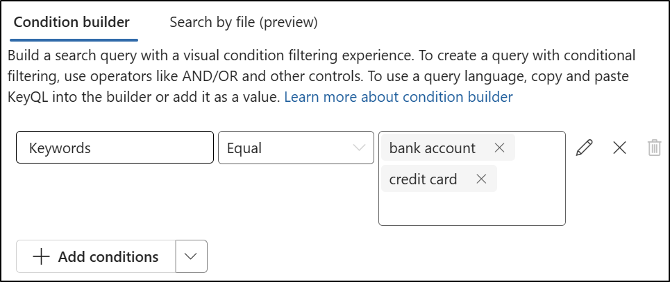

---
lab:
  title: "Exercice\_2\_: effectuer une recherche de contenu"
  module: Module 6 - Audit and search activity in Microsoft Purview
---

## Locataires WWL - Conditions d’utilisation

Si un locataire vous est fourni dans le cadre d’une formation dispensée par un instructeur, notez qu’il est mis à votre disposition dans le seul but de prendre en charge les labos pratiques de la formation.

Vous ne devez ni partager ni utiliser les locataires en dehors des labos pratiques. Le locataire utilisé dans ce cours est un locataire d’essai. Au terme de la classe, le locataire ne pourra pas faire l’objet d’une prolongation et vous ne pourrez plus l’utiliser ni y accéder.

Vous n’êtes pas autorisé à convertir un locataire en abonnement payant. Les locataires obtenus dans le cadre de ce cours sont la propriété de Microsoft Corporation. Nous nous réservons le droit d’y accéder et d’en reprendre possession à tout moment.

# Labo 6 - Exercice 2 : effectuer une recherche de contenu

Vous êtes Joni Sherman, administrateur de sécurité des informations chez Contoso Ltd. L’organisation a reçu une alerte indiquant que des données financières sensibles ont peut-être été exposées. Vous avez reçu une invitation à utiliser Microsoft Purview pour rechercher du contenu contenant des termes financiers clés dans les services Microsoft 365. Votre objectif est de déterminer si du contenu sensible a été partagé de manière inappropriée et de prendre en charge l’enquête.

**Tâches :**

1. Attribuer des autorisations eDiscovery
1. Rechercher du contenu à l’aide de termes financiers sensibles

## Tâche 1 : attribuer des autorisations eDiscovery

Dans cette tâche, vous allez attribuer des autorisations eDiscovery à Joni Sherman afin de pouvoir effectuer une recherche de contenu dans Microsoft Purview.

1. Connectez-vous à la machine virtuelle Client 1 (SC-401-CL1) en tant que compte **SC-401-CL1\admin**.

1. Si vous êtes connecté en tant que Joni, déconnectez-vous et fermez toutes les fenêtres du navigateur.

1. Ouvrez **Microsoft Edge**, accédez à **`https://purview.microsoft.com`** et connectez-vous au portail Microsoft Purview en tant qu’**administrateur ou MOD**`admin@WWLxZZZZZZ.onmicrosoft.com` (où ZZZZZZ est votre ID de locataire unique fourni par votre fournisseur d’hébergement de labo). Le mot de passe d’administrateur doit être fourni par l’hébergeur de votre labo.

1. Dans la barre latérale gauche, sélectionnez **Paramètres** > **Rôles et étendues** > **Groupes de rôles**.

1. Sur la page **Groupes de rôles pour les solutions Microsoft Purview**, recherchez `eDiscovery`, puis sélectionnez **Gestionnaire eDiscovery**.

1. Sur le panneau volant **Gestionnaire eDiscovery**, sélectionnez **Modifier**.

1. Sur la page **Gérer le Gestionnaire eDiscovery**, sélectionnez **Choisir des utilisateurs**.

1. Dans la page **Choisir des utilisateurs**, recherchez `Joni`, puis cochez la case pour **Joni Sherman**. Sélectionnez le bouton **Sélectionner** en bas du panneau.

1. De retour sur la page **Gérer le Gestionnaire eDiscovery**, sélectionnez **Suivant**.

1. Sur la page **Gérer le Gestionnaire eDiscovery**, sélectionnez **Suivant**.

1. Dans la page **Vérifier le groupe de rôles et terminer**, sélectionnez **Enregistrer**.

1. Sur la page **Vous avez mis à jour le groupe de rôles ** sélectionnez **Terminé**.

1. Déconnectez-vous du compte d’administration MOD en sélectionnant l’icône **MA** en haut à droite de la fenêtre, puis sélectionnez **Se déconnecter**.

Vous avez attribué des autorisations eDiscovery à Joni Sherman, ce qui lui permet de rechercher du contenu sensible dans le cadre de l’enquête.

## Tâche 2 : rechercher du contenu à l’aide de termes financiers sensibles

1. Dans Microsoft Edge, accédez à `https://purview.microsoft.com` et connectez-vous au portail Microsoft Purview en tant que **Joni Sherman**`JoniS@WWLxZZZZZZ.onmicrosoft.com` (où ZZZZZZ est votre ID de locataire unique fourni par votre fournisseur d’hébergement de labo). Le mot de passe de Joni a été défini dans un exercice précédent.

1. Dans le portail Microsoft Purview, accédez à **Solutions** > **eDiscovery**.

1. Dans la page **Cas**, sélectionnez la liste déroulante en regard de **Créer un cas**, puis sélectionnez **Créer une recherche**.

   

1. Dans la boîte de dialogue **Entrer les détails pour démarrer**, entrez :

   - **Nom du cas** : `Financial Data Exposure Review`
   - **Nom de recherche** : `Financial Data Leak Investigation`
   - **Description du cas** : `Case opened to support security investigation efforts by identifying potential exposure of sensitive financial terms in Microsoft 365 content.`
   - **Description de la recherche** : `Search targets common high-risk financial keywords to support data security monitoring and policy validation.`

1. Sélectionnez **Créer** pour créer la recherche.

1. Dans la page **Investigation des fuites de données financières**, sous **Sources de données**, sélectionnez **+** (signe plus) > **Ajouter des sources de données**.

   

1. Dans le menu volant **Rechercher des sources**, sélectionnez le groupe **Équipe financière**, puis sélectionnez **Enregistrer et fermer**.

1. Dans le volet **Générateur de conditions**, ajoutez les mots clés `bank account` et `credit card`, puis sélectionnez **Exécuter la requête**.

   

1. Dans le menu volant **Choisir les résultats de la recherche** sous **Statistiques**, cochez les cases pour **Inclure les catégories** et **Inclure le rapport des mots clés de requête**, puis sélectionnez **Exécuter la requête**.

1. Passez en revue les résultats de la recherche en procédant comme suit :

   - Sélectionnez l’onglet **Statistiques** pour afficher un résumé des métriques de recherche.
   - Sélectionnez l’onglet **Exemple** pour afficher un aperçu du contenu correspondant.

Vous avez effectué une recherche de contenu basée sur des mots clés pour vous aider à identifier si les données financières sensibles ont été partagées de manière inappropriée. Ces résultats prennent en charge les enquêtes de sécurité et aident à guider la réponse aux risques.
