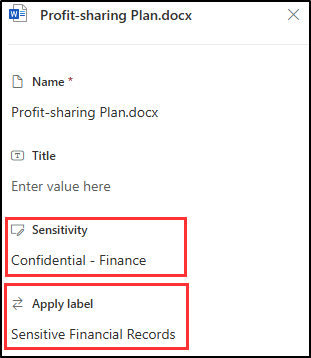

---
lab:
  title: 'Valider les stratégies de confidentialité, DLP et de rétention'
  module: 'Policy validation - Validate sensitivity, DLP, and retention policies'
---

## Locataires WWL - Conditions d’utilisation

Si un locataire vous est fourni dans le cadre d’une formation dispensée par un instructeur, notez qu’il est mis à votre disposition dans le seul but de prendre en charge les labos pratiques de la formation.

Vous ne devez ni partager ni utiliser les locataires en dehors des labos pratiques. Le locataire utilisé dans ce cours est un locataire d’essai. Au terme de la classe, le locataire ne pourra pas faire l’objet d’une prolongation et vous ne pourrez plus l’utiliser ni y accéder.

Vous n’êtes pas autorisé à convertir un locataire en abonnement payant. Les locataires obtenus dans le cadre de ce cours sont la propriété de Microsoft Corporation. Nous nous réservons le droit d’y accéder et d’en reprendre possession à tout moment.

# Labo de validation : valider les stratégies de confidentialité, DLP et de rétention

Vous êtes Joni Sherman, administrateur de la sécurité des informations chez Contoso Ltd. Maintenant que vous avez configuré des stratégies relatives aux étiquettes de confidentialité, à la protection contre la perte de données (DLP) et de rétention, vous devez vérifier que ces configurations fonctionnent comme prévu. Dans ce labo, vous allez tester le comportement de chaque stratégie dans les applications Microsoft 365 et vérifier que le contenu est protégé et conservé conformément à vos paramètres de stratégie.

**Tâches :**

1. Appliquer une étiquette de confidentialité dans Word
1. Déclencher une stratégie DLP dans Outlook
1. Appliquer des étiquettes de rétention et de confidentialité dans SharePoint

## Tâche 1 : appliquer une étiquette de confidentialité dans Word

Dans cette tâche, vous allez vérifier que les étiquettes de confidentialité publiées sont disponibles aux utilisateurs et peuvent être appliquées directement à partir de Microsoft Word.

1. Vous devez toujours être connecté à la machine virtuelle Client 1 (SC-401-CL1) en tant que compte **SC-401-CL1\admin**, et connecté à Microsoft 365 en tant que **Joni Sherman**`JoniS@WWLxZZZZZZ.onmicrosoft.com` (où ZZZZZZZ est votre ID de locataire unique fourni par votre fournisseur d’hébergement de labo). Le mot de passe de Joni a été défini dans un exercice précédent.

1. Dans Microsoft Edge, sélectionnez le lanceur d’applications en haut à gauche et choisissez **Word**.

    

1. Sélectionnez **Document vierge**.

1. Si la boîte de dialogue **Vos options de confidentialité** s’affiche, fermez-la.

1. Entrez le texte suivant dans le document :

   `Important HR employee document.`

1. Sélectionnez **Confidentialité** dans le ruban de navigation et sélectionnez **Internal** > **Employee Data (HR)**  pour appliquer l’étiquette de confidentialité nouvellement créée à ce document.

    

    > [!Note] Un délai compris entre 24 et 48 heures peut s’écouler avant que les étiquettes de confidentialité nouvellement publiées ne soient disponibles pour l’application. Si les étiquettes de confidentialité nouvellement créées ne sont pas disponibles, vous pouvez utiliser **Confidential** > **All Employees** dans cet exercice.

1. Remplacez l’étiquette de confidentialité par **Public** pour vérifier que la boîte de dialogue de justification métier s’affiche.

1. Sélectionnez **Annuler** pour conserver l’étiquette de confidentialité.

1. En haut à gauche du document, sélectionnez **Document** pour renommer ce fichier en **`HR Document`**. Appuyez sur Entrée pour appliquer cette modification de nom.

    

Vous avez vérifié que l’étiquette de confidentialité HR est disponible et applique les protections appropriées à un document Word.

## Tâche 2 : déclencher une stratégie DLP dans Outlook

Ensuite, vous allez envoyer des informations sensibles sur les employés dans un e-mail pour vérifier que votre stratégie DLP détecte et bloque correctement l’activité.

1. Vous devez toujours être connecté à la machine virtuelle Client 1 (SC-401-CL1) en tant que compte **SC-401-CL1\admin** et connecté à Microsoft 365 en tant que Joni Sherman.

1. Dans Microsoft Edge, sélectionnez le lanceur d’applications en haut à gauche et choisissez **Outlook**.

1. Sélectionnez le bouton **Nouveau message** en haut à gauche pour rédiger un nouvel e-mail.

1. Dans le champ **À** , entrez `Megan` et sélectionnez l’adresse e-mail de **Megan Bowen**.

1. Dans le champ Objet, saisissez `Help with employee information`.

1. Dans le corps du message, saisissez :

   ``` text
   Please help me with the start dates for the following employees:
   ABC123456
   DEF678901
   GHI234567

   Thank you, 
   Joni Sherman
   ```

1. Sélectionnez le bouton **Envoyer** en haut à droite de la fenêtre de message pour envoyer l’e-mail.

1. Vous devez recevoir un message indiquant que l’e-mail n’était pas remis et bloqué par une stratégie DLP.

   

Vous avez confirmé que votre stratégie DLP a bloqué la transmission des ID d’employés sensibles par e-mail.

## Tâche 3 : appliquer des étiquettes de rétention et de confidentialité dans SharePoint

Pour tester votre configuration de rétention, vous allez appliquer une étiquette de rétention à un document stocké dans SharePoint et vérifier que les étiquettes de confidentialité sont également disponibles.

1. Vous devez toujours être connecté à la machine virtuelle Client 1 (SC-401-CL1) en tant que compte **SC-401-CL1\admin** et connecté à Microsoft 365 en tant que Joni Sherman.

1. Dans Microsoft Edge, sélectionnez le lanceur d’applications en haut à gauche et choisissez **SharePoint**.

1. Dans la page d’accueil SharePoint, recherchez `Benefits`, puis sélectionnez **Benefits @ Contoso** dans les résultats de la recherche.

1. Sélectionnez **Documents** dans le volet gauche.

1. Dans la page **Documents**, sélectionnez les points de suspension en regard de **Profit-sharing Plan.docx**, puis sélectionnez **Détails**.

   

1. Dans le panneau **Détails**, mettez à jour les champs suivants :
   - **Niveau de confidentialité** : confidentiel - finance
   - **Appliquer une étiquette** : enregistrements financiers confidentiels

     

Vous avez confirmé que les étiquettes de rétention et de confidentialité sont disponibles et peuvent être appliquées aux documents SharePoint.
